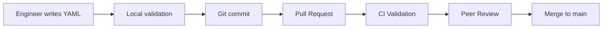

# COMPASS Enterprise Knowledge Integration Architecture
## Technical Implementation Guide

**Version:** 1.0  
**Status:** Architecture Specification  
**Audience:** Senior Engineers, Architects, Implementation Teams  
**Integration:** Extends `compass_architecture.txt` Part 4 (Knowledge Integration)

---

## Executive Summary

The Enterprise Knowledge Integration (EKI) system enables domain experts to inject their operational knowledge into COMPASS agents through declarative configuration files. This architecture document details the implementation of a git-based, hierarchical knowledge system that enhances agent behavior without requiring ML expertise or model retraining.

**Key Architecture Changes Required:**
1. New Knowledge Service component for configuration management
2. Modified Agent base class to support runtime configuration injection
3. Extended Learning System to incorporate configuration feedback
4. New validation and deployment pipeline
5. Multi-tenant knowledge isolation

---

## Table of Contents

1. [System Architecture Overview](#system-architecture-overview)
2. [Core Components](#core-components)
3. [Data Models and Schemas](#data-models-and-schemas)
4. [Configuration Lifecycle](#configuration-lifecycle)
5. [Runtime Behavior Modification](#runtime-behavior-modification)
6. [Integration Points](#integration-points)
7. [Performance and Scaling](#performance-and-scaling)
8. [Security and Multi-Tenancy](#security-and-multi-tenancy)
9. [Implementation Roadmap](#implementation-roadmap)
10. [Technical Specifications](#technical-specifications)

---

## System Architecture Overview

### High-Level Architecture

```
┌─────────────────────────────────────────────────────────────────────┐
│                         Git Repository                              │
│  ┌──────────────────┐  ┌──────────────────┐  ┌─────────────────┐  │
│  │ Global Knowledge │  │ Team Knowledge   │  │ Service Configs │  │
│  │   (Company)      │  │  (Team-specific) │  │  (Per-service)  │  │
│  └──────────────────┘  └──────────────────┘  └─────────────────┘  │
└─────────────────────────────────┬───────────────────────────────────┘
                                  │ Git Push/PR
                                  â–¼
┌─────────────────────────────────────────────────────────────────────┐
│                     Knowledge Validation Pipeline                    │
│  ┌──────────────┐  ┌──────────────┐  ┌──────────────────────────┐  │
│  │ YAML Syntax  │→ │  Schema      │→ │ Conflict Detection &    │  │
│  │ Validation   │  │  Validation  │  │ Regression Testing      │  │
│  └──────────────┘  └──────────────┘  └──────────────────────────┘  │
└─────────────────────────────────┬───────────────────────────────────┘
                                  │ Validated Configs
                                  â–¼
┌─────────────────────────────────────────────────────────────────────┐
│                      Knowledge Service (New)                         │
│  ┌──────────────────────────────────────────────────────────────┐  │
│  │                  Configuration Manager                        │  │
│  │  ┌─────────────┐  ┌──────────────┐  ┌─────────────────┐    │  │
│  │  │ Version     │  │ Hierarchy    │  │  Hot Reload    │    │  │
│  │  │ Control     │  │ Resolution   │  │  Manager       │    │  │
│  │  └─────────────┘  └──────────────┘  └─────────────────┘    │  │
│  └──────────────────────────────────────────────────────────────┘  │
│                                                                     │
│  ┌──────────────────────────────────────────────────────────────┐  │
│  │                    Knowledge Store                            │  │
│  │  ┌──────────────┐  ┌──────────────┐  ┌─────────────────┐    │  │
│  │  │ Redis Cache │  │  PostgreSQL  │  │ Vector Store    │    │  │
│  │  │ (Hot Config) │  │  (Versioned) │  │ (Embeddings)   │    │  │
│  │  └──────────────┘  └──────────────┘  └─────────────────┘    │  │
│  └──────────────────────────────────────────────────────────────┘  │
└─────────────────────────────────┬───────────────────────────────────┘
                                  │ Runtime Config API
                                  â–¼
┌─────────────────────────────────────────────────────────────────────┐
│                         Agent Runtime                                │
│  ┌──────────────────────────────────────────────────────────────┐  │
│  │              Modified BaseAgent Class                         │  │
│  │  ┌─────────────────┐  ┌──────────────────┐  ┌────────────┐  │  │
│  │  │ Config Injector │  │ Pattern Matcher  │  │ Behavior   │  │  │
│  │  │                 │  │                  │  │ Modifier   │  │  │
│  │  └─────────────────┘  └──────────────────┘  └────────────┘  │  │
│  └──────────────────────────────────────────────────────────────┘  │
│                                                                     │
│  ┌──────────────────────────────────────────────────────────────┐  │
│  │                    Specialized Agents                         │  │
│  │  ┌────────────┐  ┌────────────┐  ┌────────────┐  ┌────────┐ │  │
│  │  │  Database  │  │  Network   │  │Application │  │ Infra   │ │  │
│  │  │   Agent    │  │   Agent    │  │   Agent    │  │ Agent   │ │  │
│  │  └────────────┘  └────────────┘  └────────────┘  └────────┘ │  │
│  └──────────────────────────────────────────────────────────────┘  │
└─────────────────────────────────┬───────────────────────────────────┘
                                  │ Feedback
                                  â–¼
┌─────────────────────────────────────────────────────────────────────┐
│                    Enhanced Learning System                          │
│  ┌──────────────────────────────────────────────────────────────┐  │
│  │              Pattern Effectiveness Tracker                    │  │
│  │  ┌──────────────┐  ┌──────────────┐  ┌─────────────────┐    │  │
│  │  │ Success Rate │  │ Time Saved   │  │ False Positive  │    │  │
│  │  │ Tracking     │  │ Metrics      │  │ Reduction       │    │  │
│  │  └──────────────┘  └──────────────┘  └─────────────────┘    │  │
│  └──────────────────────────────────────────────────────────────┘  │
└──────────────────────────────────────────────────────────────────────┘
```

### Key Architecture Changes

1. **New Knowledge Service**: Centralized configuration management
2. **Modified Agent Architecture**: Runtime configuration injection
3. **Git-Based Storage**: Version-controlled knowledge repository
4. **Validation Pipeline**: CI/CD integrated validation
5. **Feedback Integration**: Pattern effectiveness tracking

---

## Core Components

### 1. Knowledge Service (New Component)

```python
from typing import Dict, List, Optional, Any
from dataclasses import dataclass
import asyncio
import yaml
from datetime import datetime
from enum import Enum

class ConfigScope(Enum):
    GLOBAL = "global"      # Company-wide
    TEAM = "team"          # Team-specific
    SERVICE = "service"    # Service-specific
    INSTANCE = "instance"  # Single instance

@dataclass
class KnowledgeConfig:
    """Represents a knowledge configuration"""
    config_id: str
    scope: ConfigScope
    scope_identifier: str  # team name, service name, etc.
    version: str
    content: Dict[str, Any]
    author: str
    created_at: datetime
    validated: bool = False
    active: bool = False
    parent_config_id: Optional[str] = None  # For inheritance

class KnowledgeService:
    """
    Central service managing all knowledge configurations.
    This is a new microservice in the COMPASS architecture.
    """
    
    def __init__(self, storage_backend, cache_backend, message_bus):
        self.storage = storage_backend  # PostgreSQL for persistence
        self.cache = cache_backend      # Redis for hot configs
        self.message_bus = message_bus  # For config update notifications
        self.validators = {}
        self.config_hierarchy = {}
        
    async def load_configuration(
        self,
        service_name: str,
        team_name: str,
        environment: str = "production"
    ) -> Dict[str, Any]:
        """
        Load merged configuration for a service.
        Implements hierarchical override: Global → Team → Service → Instance
        """
        
        # Start with global configurations
        config = await self._load_global_config(environment)
        
        # Apply team-level overrides
        team_config = await self._load_team_config(team_name, environment)
        config = self._merge_configs(config, team_config)
        
        # Apply service-level overrides
        service_config = await self._load_service_config(
            service_name, team_name, environment
        )
        config = self._merge_configs(config, service_config)
        
        # Apply any instance-specific overrides (e.g., for testing)
        instance_config = await self._load_instance_config(service_name)
        if instance_config:
            config = self._merge_configs(config, instance_config)
        
        # Cache the merged configuration
        await self._cache_config(service_name, config)
        
        return config
    
    async def validate_configuration(
        self,
        config: Dict[str, Any],
        scope: ConfigScope,
        scope_identifier: str
    ) -> ValidationResult:
        """
        Validate configuration against schema and business rules
        """
        
        result = ValidationResult()
        
        # 1. Schema validation
        schema_errors = self._validate_schema(config, scope)
        if schema_errors:
            result.add_errors(schema_errors)
            return result
        
        # 2. Conflict detection
        conflicts = await self._detect_conflicts(config, scope, scope_identifier)
        if conflicts:
            result.add_warnings(conflicts)
        
        # 3. Pattern validation
        pattern_issues = self._validate_patterns(config)
        if pattern_issues:
            result.add_warnings(pattern_issues)
        
        # 4. Performance impact assessment
        perf_impact = await self._assess_performance_impact(config)
        if perf_impact.estimated_overhead_ms > 100:
            result.add_warning(
                f"Configuration may add {perf_impact.estimated_overhead_ms}ms latency"
            )
        
        # 5. Regression testing against historical incidents
        regression_results = await self._run_regression_tests(config)
        if regression_results.degraded_accuracy:
            result.add_error("Configuration degrades accuracy on historical incidents")
        
        result.valid = len(result.errors) == 0
        return result
    
    async def deploy_configuration(
        self,
        config: KnowledgeConfig,
        environment: str,
        deployment_strategy: str = "rolling"
    ) -> DeploymentResult:
        """
        Deploy configuration to specified environment
        """
        
        if deployment_strategy == "rolling":
            return await self._rolling_deployment(config, environment)
        elif deployment_strategy == "canary":
            return await self._canary_deployment(config, environment)
        elif deployment_strategy == "blue_green":
            return await self._blue_green_deployment(config, environment)
        else:
            return await self._immediate_deployment(config, environment)
    
    async def _rolling_deployment(
        self,
        config: KnowledgeConfig,
        environment: str
    ) -> DeploymentResult:
        """
        Gradually roll out configuration to agents
        """
        
        result = DeploymentResult()
        
        # Get list of agents that will use this config
        target_agents = await self._get_target_agents(config, environment)
        
        # Deploy to 10% of agents first
        canary_size = max(1, len(target_agents) // 10)
        canary_agents = target_agents[:canary_size]
        
        # Deploy to canary agents
        for agent in canary_agents:
            await self._deploy_to_agent(agent, config)
        
        # Monitor for 5 minutes
        await asyncio.sleep(300)
        
        # Check metrics
        metrics = await self._get_deployment_metrics(canary_agents)
        if metrics.error_rate > 0.05:  # More than 5% errors
            # Rollback
            await self._rollback_agents(canary_agents)
            result.success = False
            result.reason = f"High error rate: {metrics.error_rate}"
            return result
        
        # Deploy to remaining agents in batches
        batch_size = len(target_agents) // 5  # 20% at a time
        for i in range(canary_size, len(target_agents), batch_size):
            batch = target_agents[i:i + batch_size]
            for agent in batch:
                await self._deploy_to_agent(agent, config)
            
            # Brief monitoring between batches
            await asyncio.sleep(30)
        
        result.success = True
        result.deployed_to = len(target_agents)
        return result
    
    def _merge_configs(
        self,
        base: Dict[str, Any],
        override: Dict[str, Any]
    ) -> Dict[str, Any]:
        """
        Deep merge configurations with override precedence
        """
        
        merged = base.copy()
        
        for key, value in override.items():
            if key in merged and isinstance(merged[key], dict) and isinstance(value, dict):
                # Recursive merge for nested dicts
                merged[key] = self._merge_configs(merged[key], value)
            elif key in merged and isinstance(merged[key], list) and isinstance(value, list):
                # Special handling for lists based on merge strategy
                if value and isinstance(value[0], dict) and "_merge_strategy" in value[0]:
                    strategy = value[0]["_merge_strategy"]
                    if strategy == "replace":
                        merged[key] = value[1:]  # Skip strategy indicator
                    elif strategy == "append":
                        merged[key].extend(value[1:])
                    elif strategy == "prepend":
                        merged[key] = value[1:] + merged[key]
                else:
                    # Default: replace entire list
                    merged[key] = value
            else:
                # Simple replacement
                merged[key] = value
        
        return merged
```

### 2. Modified BaseAgent Architecture

```python
class EnhancedBaseAgent(BaseAgent):
    """
    Modified BaseAgent that supports runtime configuration injection
    """
    
    def __init__(self, agent_type: str, knowledge_service: KnowledgeService):
        super().__init__(agent_type)
        self.knowledge_service = knowledge_service
        self.config_cache = {}
        self.config_version = None
        self.pattern_matchers = {}
        self.behavior_modifiers = []
        
    async def initialize(self, service_name: str, team_name: str):
        """
        Initialize agent with knowledge configuration
        """
        
        # Load configuration from Knowledge Service
        self.config = await self.knowledge_service.load_configuration(
            service_name=service_name,
            team_name=team_name,
            environment=self.environment
        )
        
        # Build pattern matchers from config
        self._build_pattern_matchers()
        
        # Initialize behavior modifiers
        self._initialize_behavior_modifiers()
        
        # Subscribe to configuration updates
        await self._subscribe_to_config_updates()
    
    def _build_pattern_matchers(self):
        """
        Convert configuration patterns into efficient matchers
        """
        
        if "behavior_patterns" not in self.config:
            return
        
        patterns = self.config["behavior_patterns"]
        
        # Build normal behavior patterns
        if "normal_behaviors" in patterns:
            for pattern_config in patterns["normal_behaviors"]:
                matcher = PatternMatcher(pattern_config)
                self.pattern_matchers[pattern_config["pattern"]] = matcher
        
        # Build error classification patterns
        if "error_classifications" in self.config:
            self.error_classifier = ErrorClassifier(
                self.config["error_classifications"]
            )
    
    async def should_investigate(self, observation: Observation) -> bool:
        """
        Determine if observation warrants investigation using config
        """
        
        # Check against ignore patterns first
        if self.error_classifier and self.error_classifier.should_ignore(observation):
            await self._log_ignored_observation(observation)
            return False
        
        # Check if matches critical error patterns
        if self.error_classifier and self.error_classifier.is_critical(observation):
            await self._escalate_immediately(observation)
            return True
        
        # Check maintenance windows
        if await self._is_maintenance_window(observation.timestamp):
            await self._log_maintenance_suppression(observation)
            return False
        
        # Apply normal investigation logic
        return await super().should_investigate(observation)
    
    async def generate_hypothesis(
        self,
        observations: List[Observation]
    ) -> List[Hypothesis]:
        """
        Generate hypotheses using both ML and configured patterns
        """
        
        hypotheses = []
        
        # 1. Get ML-generated hypotheses
        ml_hypotheses = await super().generate_hypothesis(observations)
        hypotheses.extend(ml_hypotheses)
        
        # 2. Apply configured investigation strategies
        if "investigation_strategies" in self.config:
            config_hypotheses = await self._apply_investigation_strategies(
                observations
            )
            hypotheses.extend(config_hypotheses)
        
        # 3. Check against known issues
        if "known_issues" in self.config.get("behavior_patterns", {}):
            known_issue_hypotheses = self._check_known_issues(observations)
            hypotheses.extend(known_issue_hypotheses)
        
        # 4. Deduplicate and rank
        hypotheses = self._deduplicate_hypotheses(hypotheses)
        hypotheses = self._rank_hypotheses(hypotheses)
        
        return hypotheses[:5]  # Top 5 hypotheses
    
    async def _apply_investigation_strategies(
        self,
        observations: List[Observation]
    ) -> List[Hypothesis]:
        """
        Apply configured investigation strategies to generate hypotheses
        """
        
        hypotheses = []
        strategies = self.config["investigation_strategies"]
        
        for strategy_name, strategy_config in strategies.items():
            # Check if strategy trigger condition is met
            if self._strategy_triggered(strategy_config["trigger"], observations):
                # Generate hypothesis from strategy
                hypothesis = Hypothesis(
                    description=f"Based on {strategy_name} pattern",
                    confidence=strategy_config.get("confidence", 0.7),
                    evidence=self._extract_strategy_evidence(
                        strategy_config,
                        observations
                    ),
                    source="configuration",
                    investigation_steps=strategy_config.get(
                        "investigation_sequence", []
                    )
                )
                hypotheses.append(hypothesis)
        
        return hypotheses
    
    async def _hot_reload_configuration(self, new_config: Dict[str, Any]):
        """
        Hot reload configuration without restarting agent
        """
        
        # Validate new configuration
        validation_result = await self.knowledge_service.validate_configuration(
            new_config,
            ConfigScope.SERVICE,
            self.service_name
        )
        
        if not validation_result.valid:
            logger.error(f"Invalid configuration: {validation_result.errors}")
            return
        
        # Apply new configuration
        old_config = self.config
        self.config = new_config
        
        try:
            # Rebuild pattern matchers
            self._build_pattern_matchers()
            
            # Reinitialize behavior modifiers
            self._initialize_behavior_modifiers()
            
            logger.info(f"Successfully hot-reloaded configuration v{new_config['version']}")
        except Exception as e:
            # Rollback on error
            logger.error(f"Failed to apply configuration: {e}")
            self.config = old_config
            self._build_pattern_matchers()
            self._initialize_behavior_modifiers()
```

### 3. Configuration Schema and Validation

```python
from marshmallow import Schema, fields, validates, ValidationError
from typing import Dict, List, Any

class PatternSchema(Schema):
    """Schema for behavior patterns"""
    
    pattern = fields.Str(required=True)
    description = fields.Str(required=True)
    ignore_if = fields.List(fields.Dict(), missing=[])
    expected_range = fields.Dict(missing={})
    investigation_hint = fields.Str(missing=None)
    runbook_link = fields.Url(missing=None)
    
    @validates("pattern")
    def validate_pattern(self, value):
        """Validate pattern syntax"""
        try:
            # Attempt to compile as regex
            import re
            re.compile(value)
        except re.error as e:
            raise ValidationError(f"Invalid regex pattern: {e}")

class ErrorClassificationSchema(Schema):
    """Schema for error classifications"""
    
    ignore_list = fields.List(fields.Dict(), missing=[])
    critical_errors = fields.List(fields.Dict(), missing=[])
    
    @validates("ignore_list")
    def validate_ignore_list(self, value):
        """Ensure ignore patterns don't conflict with critical errors"""
        # Implementation here
        pass

class ServiceConfigSchema(Schema):
    """Main service configuration schema"""
    
    service = fields.Dict(required=True)
    behavior_patterns = fields.Nested(PatternSchema, many=True, missing=[])
    error_classifications = fields.Nested(ErrorClassificationSchema, missing={})
    maintenance_windows = fields.Dict(missing={})
    investigation_strategies = fields.Dict(missing={})
    monitoring_integration = fields.Dict(missing={})
    
    class Meta:
        strict = True  # Reject unknown fields

class ConfigurationValidator:
    """Validates configurations at multiple levels"""
    
    def __init__(self):
        self.schemas = {
            ConfigScope.GLOBAL: GlobalConfigSchema(),
            ConfigScope.TEAM: TeamConfigSchema(),
            ConfigScope.SERVICE: ServiceConfigSchema(),
            ConfigScope.INSTANCE: InstanceConfigSchema()
        }
    
    def validate(
        self,
        config: Dict[str, Any],
        scope: ConfigScope
    ) -> ValidationResult:
        """
        Validate configuration against appropriate schema
        """
        
        result = ValidationResult()
        schema = self.schemas[scope]
        
        try:
            validated_data = schema.load(config)
            result.valid = True
            result.data = validated_data
        except ValidationError as e:
            result.valid = False
            result.errors = e.messages
        
        # Additional business logic validation
        if result.valid:
            business_errors = self._validate_business_rules(validated_data, scope)
            if business_errors:
                result.valid = False
                result.errors.extend(business_errors)
        
        return result
    
    def _validate_business_rules(
        self,
        config: Dict[str, Any],
        scope: ConfigScope
    ) -> List[str]:
        """
        Validate business-specific rules
        """
        
        errors = []
        
        # Example: Ensure critical services have runbooks
        if scope == ConfigScope.SERVICE:
            if config.get("service", {}).get("critical_tier") == 1:
                if not config.get("investigation_strategies"):
                    errors.append("Critical services must have investigation strategies")
        
        # Example: Validate timeout hierarchies
        if "timeout_configurations" in config:
            timeouts = config["timeout_configurations"]["service_defaults"]
            if timeouts.get("http_timeout", 30) < timeouts.get("database_timeout", 5):
                errors.append("HTTP timeout should be >= database timeout")
        
        return errors
```

### 4. Pattern Matching Engine

```python
import re
from typing import Dict, List, Any, Optional
from dataclasses import dataclass
from datetime import datetime, timedelta

@dataclass
class PatternMatch:
    """Represents a pattern match result"""
    pattern_name: str
    confidence: float
    matched_data: Dict[str, Any]
    action: str  # "ignore", "investigate", "escalate"
    reason: str
    metadata: Dict[str, Any] = None

class PatternMatcher:
    """
    High-performance pattern matching engine
    """
    
    def __init__(self, pattern_config: Dict[str, Any]):
        self.config = pattern_config
        self.pattern_name = pattern_config["pattern"]
        self.compiled_patterns = self._compile_patterns()
        self.condition_evaluator = ConditionEvaluator()
    
    def _compile_patterns(self) -> Dict[str, re.Pattern]:
        """
        Pre-compile regex patterns for performance
        """
        
        compiled = {}
        
        if isinstance(self.config["pattern"], str):
            # Simple string pattern
            try:
                compiled["main"] = re.compile(self.config["pattern"])
            except re.error:
                # Not a regex, treat as literal string
                compiled["main"] = self.config["pattern"]
        
        # Compile sub-patterns if any
        for key in ["error_pattern", "log_pattern", "metric_pattern"]:
            if key in self.config:
                try:
                    compiled[key] = re.compile(self.config[key])
                except re.error:
                    compiled[key] = self.config[key]
        
        return compiled
    
    def match(self, observation: Observation) -> Optional[PatternMatch]:
        """
        Check if observation matches this pattern
        """
        
        # Check main pattern
        if not self._matches_main_pattern(observation):
            return None
        
        # Check conditions
        if "conditions" in self.config:
            if not self._evaluate_conditions(observation):
                return None
        
        # Check ignore conditions
        if "ignore_if" in self.config:
            if self._matches_ignore_conditions(observation):
                return PatternMatch(
                    pattern_name=self.pattern_name,
                    confidence=0.9,
                    matched_data=observation.data,
                    action="ignore",
                    reason=self.config.get("reason", "Matches ignore pattern")
                )
        
        # Determine action based on pattern type
        action = self._determine_action(observation)
        
        return PatternMatch(
            pattern_name=self.pattern_name,
            confidence=self._calculate_confidence(observation),
            matched_data=self._extract_matched_data(observation),
            action=action,
            reason=self.config.get("description", "Pattern match"),
            metadata=self._extract_metadata(observation)
        )
    
    def _matches_main_pattern(self, observation: Observation) -> bool:
        """
        Check if observation matches the main pattern
        """
        
        pattern = self.compiled_patterns.get("main")
        
        if isinstance(pattern, re.Pattern):
            # Regex matching
            if hasattr(observation, "message"):
                return bool(pattern.search(observation.message))
            elif hasattr(observation, "error"):
                return bool(pattern.search(observation.error))
        elif isinstance(pattern, str):
            # Literal string matching
            if hasattr(observation, "message"):
                return pattern in observation.message
            elif hasattr(observation, "error"):
                return pattern in observation.error
        
        return False
    
    def _evaluate_conditions(self, observation: Observation) -> bool:
        """
        Evaluate complex conditions
        """
        
        for condition in self.config["conditions"]:
            if not self.condition_evaluator.evaluate(condition, observation):
                return False
        return True

class ConditionEvaluator:
    """
    Evaluates complex conditions from configuration
    """
    
    def evaluate(self, condition: Dict[str, Any], observation: Observation) -> bool:
        """
        Evaluate a condition against an observation
        """
        
        # Handle different condition types
        if "rate" in condition:
            return self._evaluate_rate_condition(condition["rate"], observation)
        elif "threshold" in condition:
            return self._evaluate_threshold_condition(condition["threshold"], observation)
        elif "time_window" in condition:
            return self._evaluate_time_condition(condition["time_window"], observation)
        elif "all" in condition:
            # AND condition
            return all(self.evaluate(c, observation) for c in condition["all"])
        elif "any" in condition:
            # OR condition
            return any(self.evaluate(c, observation) for c in condition["any"])
        elif "not" in condition:
            # NOT condition
            return not self.evaluate(condition["not"], observation)
        
        return True
    
    def _evaluate_rate_condition(self, rate_spec: str, observation: Observation) -> bool:
        """
        Evaluate rate-based conditions (e.g., "< 0.1%")
        """
        
        import re
        match = re.match(r"([<>]=?)\s*([\d.]+)(%)?", rate_spec)
        if not match:
            return False
        
        operator, value, is_percentage = match.groups()
        threshold = float(value)
        
        if is_percentage:
            threshold = threshold / 100
        
        actual_rate = observation.metrics.get("error_rate", 0)
        
        if operator == "<":
            return actual_rate < threshold
        elif operator == "<=":
            return actual_rate <= threshold
        elif operator == ">":
            return actual_rate > threshold
        elif operator == ">=":
            return actual_rate >= threshold
        
        return False
```

### 5. Runtime Configuration Management

```python
class ConfigurationRuntime:
    """
    Manages runtime configuration lifecycle
    """
    
    def __init__(self, knowledge_service: KnowledgeService):
        self.knowledge_service = knowledge_service
        self.active_configs: Dict[str, KnowledgeConfig] = {}
        self.config_subscribers: Dict[str, List[ConfigSubscriber]] = {}
        self.performance_monitor = PerformanceMonitor()
    
    async def start(self):
        """
        Start configuration runtime
        """
        
        # Load initial configurations
        await self._load_initial_configs()
        
        # Start configuration watcher
        asyncio.create_task(self._watch_configurations())
        
        # Start performance monitoring
        asyncio.create_task(self._monitor_performance())
    
    async def _watch_configurations(self):
        """
        Watch for configuration changes
        """
        
        while True:
            try:
                # Check for updates every 30 seconds
                await asyncio.sleep(30)
                
                updates = await self.knowledge_service.check_for_updates()
                
                for update in updates:
                    await self._apply_update(update)
                    
            except Exception as e:
                logger.error(f"Configuration watch error: {e}")
    
    async def _apply_update(self, update: ConfigUpdate):
        """
        Apply configuration update to running agents
        """
        
        # Validate update
        validation_result = await self.knowledge_service.validate_configuration(
            update.config,
            update.scope,
            update.scope_identifier
        )
        
        if not validation_result.valid:
            logger.error(f"Invalid configuration update: {validation_result.errors}")
            await self._notify_update_failure(update, validation_result)
            return
        
        # Get affected subscribers
        subscribers = self._get_affected_subscribers(update)
        
        # Apply update strategy
        if update.strategy == "immediate":
            await self._immediate_update(subscribers, update)
        elif update.strategy == "graceful":
            await self._graceful_update(subscribers, update)
        elif update.strategy == "canary":
            await self._canary_update(subscribers, update)
    
    async def _immediate_update(
        self,
        subscribers: List[ConfigSubscriber],
        update: ConfigUpdate
    ):
        """
        Immediately update all subscribers
        """
        
        tasks = []
        for subscriber in subscribers:
            task = asyncio.create_task(
                subscriber.on_configuration_update(update.config)
            )
            tasks.append(task)
        
        results = await asyncio.gather(*tasks, return_exceptions=True)
        
        # Track success/failure
        success_count = sum(1 for r in results if not isinstance(r, Exception))
        failure_count = len(results) - success_count
        
        await self._record_update_metrics(update, success_count, failure_count)
    
    async def _monitor_performance(self):
        """
        Monitor configuration performance impact
        """
        
        while True:
            await asyncio.sleep(60)  # Check every minute
            
            for config_id, config in self.active_configs.items():
                metrics = await self.performance_monitor.get_metrics(config_id)
                
                # Check if configuration is degrading performance
                if metrics.latency_increase_ms > 100:
                    logger.warning(
                        f"Configuration {config_id} adding {metrics.latency_increase_ms}ms latency"
                    )
                    
                if metrics.error_rate_increase > 0.01:
                    logger.error(
                        f"Configuration {config_id} increasing errors by {metrics.error_rate_increase * 100}%"
                    )
                    
                    # Consider automatic rollback
                    if metrics.error_rate_increase > 0.05:
                        await self._rollback_configuration(config_id)
```

---

## Data Models and Schemas

### Configuration Data Model

```sql
-- PostgreSQL schema for configuration storage

-- Configuration versions table
CREATE TABLE knowledge_configs (
    config_id UUID PRIMARY KEY DEFAULT gen_random_uuid(),
    scope VARCHAR(50) NOT NULL CHECK (scope IN ('global', 'team', 'service', 'instance')),
    scope_identifier VARCHAR(255) NOT NULL,
    version VARCHAR(50) NOT NULL,
    content JSONB NOT NULL,
    author VARCHAR(255) NOT NULL,
    created_at TIMESTAMPTZ DEFAULT NOW(),
    validated BOOLEAN DEFAULT FALSE,
    active BOOLEAN DEFAULT FALSE,
    parent_config_id UUID REFERENCES knowledge_configs(config_id),
    
    -- Metadata
    git_commit_hash VARCHAR(40),
    pull_request_id VARCHAR(50),
    environment VARCHAR(50),
    
    -- Versioning
    UNIQUE(scope, scope_identifier, version),
    INDEX idx_active_configs (scope, scope_identifier, active),
    INDEX idx_created_at (created_at DESC)
);

-- Configuration deployment history
CREATE TABLE config_deployments (
    deployment_id UUID PRIMARY KEY DEFAULT gen_random_uuid(),
    config_id UUID REFERENCES knowledge_configs(config_id),
    environment VARCHAR(50) NOT NULL,
    deployment_strategy VARCHAR(50),
    started_at TIMESTAMPTZ DEFAULT NOW(),
    completed_at TIMESTAMPTZ,
    status VARCHAR(50) NOT NULL,
    deployed_to_count INTEGER,
    error_count INTEGER DEFAULT 0,
    rollback_reason TEXT,
    metrics JSONB
);

-- Pattern effectiveness tracking
CREATE TABLE pattern_effectiveness (
    pattern_id UUID PRIMARY KEY DEFAULT gen_random_uuid(),
    config_id UUID REFERENCES knowledge_configs(config_id),
    pattern_name VARCHAR(255) NOT NULL,
    
    -- Effectiveness metrics
    trigger_count INTEGER DEFAULT 0,
    correct_count INTEGER DEFAULT 0,
    false_positive_count INTEGER DEFAULT 0,
    false_negative_count INTEGER DEFAULT 0,
    
    -- Performance metrics
    avg_time_saved_seconds FLOAT,
    avg_investigation_time_seconds FLOAT,
    
    -- Feedback
    human_feedback_score FLOAT,
    last_triggered TIMESTAMPTZ,
    last_validated TIMESTAMPTZ,
    
    INDEX idx_pattern_effectiveness (config_id, pattern_name),
    INDEX idx_last_triggered (last_triggered DESC)
);

-- Configuration feedback
CREATE TABLE config_feedback (
    feedback_id UUID PRIMARY KEY DEFAULT gen_random_uuid(),
    config_id UUID REFERENCES knowledge_configs(config_id),
    incident_id VARCHAR(255),
    engineer_id VARCHAR(255),
    
    -- Ratings
    accuracy_rating INTEGER CHECK (accuracy_rating BETWEEN 1 AND 5),
    usefulness_rating INTEGER CHECK (usefulness_rating BETWEEN 1 AND 5),
    
    -- Specific feedback
    helped_identify_issue BOOLEAN,
    caused_false_positive BOOLEAN,
    missed_real_issue BOOLEAN,
    
    comments TEXT,
    created_at TIMESTAMPTZ DEFAULT NOW()
);
```

### Redis Cache Structure

```python
# Redis key patterns for configuration cache

class ConfigCacheKeys:
    """
    Redis key patterns for configuration caching
    """
    
    # Active configuration for a service
    # Key: config:active:{service_name}
    # Value: JSON configuration
    # TTL: 5 minutes (refreshed on access)
    ACTIVE_CONFIG = "config:active:{service_name}"
    
    # Merged configuration (after hierarchy resolution)
    # Key: config:merged:{team}:{service}:{environment}
    # Value: JSON merged configuration
    # TTL: 2 minutes
    MERGED_CONFIG = "config:merged:{team}:{service}:{environment}"
    
    # Pattern match cache
    # Key: pattern:match:{pattern_hash}:{observation_hash}
    # Value: match result
    # TTL: 1 hour
    PATTERN_MATCH_CACHE = "pattern:match:{pattern_hash}:{observation_hash}"
    
    # Configuration version tracking
    # Key: config:version:{service_name}
    # Value: version string
    # TTL: None (persistent)
    CONFIG_VERSION = "config:version:{service_name}"
    
    # Hot reload notifications
    # Channel: config:updates:{service_name}
    # Message: configuration update notification
    UPDATE_CHANNEL = "config:updates:{service_name}"
```

---

## Configuration Lifecycle

### 1. Development Phase



### 2. Validation Pipeline

```yaml
# .github/workflows/knowledge-validation.yml
name: Knowledge Configuration Validation

on:
  pull_request:
    paths:
      - 'knowledge/**/*.yaml'
      - 'knowledge/**/*.yml'

jobs:
  validate:
    runs-on: ubuntu-latest
    
    steps:
      - uses: actions/checkout@v3
      
      - name: Setup Python
        uses: actions/setup-python@v4
        with:
          python-version: '3.11'
      
      - name: Install COMPASS CLI
        run: |
          pip install compass-cli
          pip install -r requirements.txt
      
      - name: Validate YAML Syntax
        run: |
          yamllint knowledge/
      
      - name: Schema Validation
        run: |
          compass validate schemas \
            --config-dir knowledge/ \
            --schema-dir schemas/
      
      - name: Conflict Detection
        run: |
          compass validate conflicts \
            --config-dir knowledge/ \
            --report-file conflict-report.json
      
      - name: Regression Testing
        run: |
          compass test regression \
            --config-dir knowledge/ \
            --test-data tests/historical_incidents.json \
            --baseline-metrics tests/baseline_metrics.json
      
      - name: Performance Impact Assessment
        run: |
          compass test performance \
            --config-dir knowledge/ \
            --max-latency-increase 50ms \
            --max-pattern-count 1000
      
      - name: Security Scan
        run: |
          compass security scan \
            --config-dir knowledge/ \
            --check-credentials \
            --check-sensitive-data
      
      - name: Generate Report
        if: always()
        run: |
          compass report generate \
            --validation-results . \
            --output-format markdown \
            --output-file validation-report.md
      
      - name: Comment on PR
        if: always()
        uses: actions/github-script@v6
        with:
          script: |
            const fs = require('fs');
            const report = fs.readFileSync('validation-report.md', 'utf8');
            github.rest.issues.createComment({
              issue_number: context.issue.number,
              owner: context.repo.owner,
              repo: context.repo.repo,
              body: report
            });
```

### 3. Deployment Pipeline

```python
class ConfigurationDeploymentPipeline:
    """
    Handles configuration deployment lifecycle
    """
    
    def __init__(self, knowledge_service: KnowledgeService):
        self.knowledge_service = knowledge_service
        self.deployment_strategies = {
            "immediate": ImmediateDeployment(),
            "rolling": RollingDeployment(),
            "canary": CanaryDeployment(),
            "blue_green": BlueGreenDeployment()
        }
    
    async def deploy(
        self,
        config_path: str,
        environment: str,
        strategy: str = "rolling"
    ) -> DeploymentResult:
        """
        Deploy configuration through the pipeline
        """
        
        # 1. Load configuration
        config = await self._load_config_from_git(config_path)
        
        # 2. Pre-deployment validation
        validation = await self._pre_deployment_validation(config, environment)
        if not validation.passed:
            return DeploymentResult(success=False, reason=validation.reason)
        
        # 3. Create deployment plan
        plan = await self._create_deployment_plan(config, environment, strategy)
        
        # 4. Execute deployment
        deployer = self.deployment_strategies[strategy]
        result = await deployer.deploy(config, plan)
        
        # 5. Post-deployment validation
        if result.success:
            post_validation = await self._post_deployment_validation(config, environment)
            if not post_validation.passed:
                # Rollback
                await deployer.rollback(config, plan)
                result.success = False
                result.reason = f"Post-deployment validation failed: {post_validation.reason}"
        
        # 6. Record deployment
        await self._record_deployment(config, environment, result)
        
        return result
```

---

## Runtime Behavior Modification

### How Configurations Modify Agent Behavior

```python
class BehaviorModificationEngine:
    """
    Engine for runtime behavior modification based on configurations
    """
    
    def __init__(self):
        self.modifiers: List[BehaviorModifier] = []
        self.filters: List[ObservationFilter] = []
        self.enhancers: List[HypothesisEnhancer] = []
    
    def apply_configuration(self, config: Dict[str, Any]):
        """
        Apply configuration to modify behavior
        """
        
        # Clear existing modifiers
        self.modifiers.clear()
        self.filters.clear()
        self.enhancers.clear()
        
        # Build modifiers from config
        if "error_classifications" in config:
            self.filters.append(
                ErrorClassificationFilter(config["error_classifications"])
            )
        
        if "maintenance_windows" in config:
            self.filters.append(
                MaintenanceWindowFilter(config["maintenance_windows"])
            )
        
        if "investigation_strategies" in config:
            self.enhancers.append(
                StrategyBasedEnhancer(config["investigation_strategies"])
            )
        
        if "timeout_configurations" in config:
            self.modifiers.append(
                TimeoutBehaviorModifier(config["timeout_configurations"])
            )
    
    async def filter_observations(
        self,
        observations: List[Observation]
    ) -> List[Observation]:
        """
        Filter observations based on configuration
        """
        
        filtered = observations
        
        for filter_obj in self.filters:
            filtered = await filter_obj.filter(filtered)
        
        return filtered
    
    async def enhance_hypothesis(
        self,
        hypothesis: Hypothesis,
        observations: List[Observation]
    ) -> Hypothesis:
        """
        Enhance hypothesis with configuration knowledge
        """
        
        enhanced = hypothesis
        
        for enhancer in self.enhancers:
            enhanced = await enhancer.enhance(enhanced, observations)
        
        return enhanced

class ErrorClassificationFilter(ObservationFilter):
    """
    Filters observations based on error classification rules
    """
    
    def __init__(self, classification_config: Dict[str, Any]):
        self.ignore_patterns = self._compile_ignore_patterns(
            classification_config.get("ignore_list", [])
        )
        self.critical_patterns = self._compile_critical_patterns(
            classification_config.get("critical_errors", [])
        )
    
    async def filter(self, observations: List[Observation]) -> List[Observation]:
        """
        Filter observations based on classification
        """
        
        filtered = []
        
        for obs in observations:
            # Check ignore patterns
            if self._matches_ignore_pattern(obs):
                logger.debug(f"Ignoring observation: {obs.id} (matches ignore pattern)")
                continue
            
            # Mark critical observations
            if self._matches_critical_pattern(obs):
                obs.priority = Priority.CRITICAL
                obs.metadata["escalate"] = True
            
            filtered.append(obs)
        
        return filtered
```

---

## Integration Points

### 1. Integration with Existing COMPASS Components

```python
class KnowledgeIntegrationPoints:
    """
    Defines integration points with existing COMPASS architecture
    """
    
    @staticmethod
    async def integrate_with_orchestrator(
        orchestrator: InvestigationOrchestrator,
        knowledge_service: KnowledgeService
    ):
        """
        Integrate knowledge service with orchestrator
        """
        
        # Inject knowledge service
        orchestrator.knowledge_service = knowledge_service
        
        # Override agent initialization
        original_init = orchestrator.initialize_agents
        
        async def enhanced_init(incident: Incident):
            # Original initialization
            agents = await original_init(incident)
            
            # Enhance with configurations
            for agent in agents:
                config = await knowledge_service.load_configuration(
                    service_name=incident.service,
                    team_name=incident.team
                )
                agent.apply_configuration(config)
            
            return agents
        
        orchestrator.initialize_agents = enhanced_init
    
    @staticmethod
    async def integrate_with_learning_system(
        learning_system: LearningSystem,
        knowledge_service: KnowledgeService
    ):
        """
        Integrate configuration feedback with learning system
        """
        
        # Add configuration effectiveness tracking
        async def track_pattern_effectiveness(
            pattern_name: str,
            incident_id: str,
            was_helpful: bool
        ):
            await knowledge_service.record_pattern_effectiveness(
                pattern_name=pattern_name,
                incident_id=incident_id,
                was_helpful=was_helpful
            )
        
        learning_system.track_pattern_effectiveness = track_pattern_effectiveness
```

### 2. API Specifications

```python
from fastapi import FastAPI, HTTPException, BackgroundTasks
from pydantic import BaseModel
from typing import List, Optional, Dict, Any

app = FastAPI(title="COMPASS Knowledge API")

class ConfigurationRequest(BaseModel):
    service_name: str
    team_name: str
    environment: str = "production"

class ConfigurationResponse(BaseModel):
    config_id: str
    version: str
    content: Dict[str, Any]
    active: bool
    last_updated: datetime

class ValidationRequest(BaseModel):
    configuration: Dict[str, Any]
    scope: str
    scope_identifier: str

class ValidationResponse(BaseModel):
    valid: bool
    errors: List[str]
    warnings: List[str]

@app.post("/api/v1/configurations", response_model=ConfigurationResponse)
async def create_configuration(
    config: Dict[str, Any],
    scope: str,
    scope_identifier: str,
    author: str
):
    """Create a new configuration"""
    
    # Validate
    validation_result = await knowledge_service.validate_configuration(
        config, ConfigScope(scope), scope_identifier
    )
    
    if not validation_result.valid:
        raise HTTPException(400, detail=validation_result.errors)
    
    # Store
    config_obj = await knowledge_service.create_configuration(
        config, scope, scope_identifier, author
    )
    
    return ConfigurationResponse(
        config_id=config_obj.config_id,
        version=config_obj.version,
        content=config_obj.content,
        active=config_obj.active,
        last_updated=config_obj.created_at
    )

@app.get("/api/v1/configurations/{service_name}", response_model=ConfigurationResponse)
async def get_configuration(
    service_name: str,
    team_name: str,
    environment: str = "production"
):
    """Get merged configuration for a service"""
    
    config = await knowledge_service.load_configuration(
        service_name, team_name, environment
    )
    
    if not config:
        raise HTTPException(404, detail="Configuration not found")
    
    return ConfigurationResponse(content=config)

@app.post("/api/v1/configurations/validate", response_model=ValidationResponse)
async def validate_configuration(request: ValidationRequest):
    """Validate a configuration without storing it"""
    
    result = await knowledge_service.validate_configuration(
        request.configuration,
        ConfigScope(request.scope),
        request.scope_identifier
    )
    
    return ValidationResponse(
        valid=result.valid,
        errors=result.errors,
        warnings=result.warnings
    )

@app.post("/api/v1/configurations/{config_id}/deploy")
async def deploy_configuration(
    config_id: str,
    environment: str,
    strategy: str = "rolling",
    background_tasks: BackgroundTasks = BackgroundTasks()
):
    """Deploy a configuration to an environment"""
    
    config = await knowledge_service.get_configuration(config_id)
    
    if not config:
        raise HTTPException(404, detail="Configuration not found")
    
    # Deploy in background
    background_tasks.add_task(
        knowledge_service.deploy_configuration,
        config,
        environment,
        strategy
    )
    
    return {"message": "Deployment initiated", "deployment_id": str(uuid.uuid4())}

@app.get("/api/v1/patterns/effectiveness")
async def get_pattern_effectiveness(
    team_name: Optional[str] = None,
    days: int = 30
):
    """Get pattern effectiveness metrics"""
    
    metrics = await knowledge_service.get_pattern_effectiveness(
        team_name=team_name,
        days=days
    )
    
    return metrics

@app.post("/api/v1/feedback")
async def submit_feedback(
    config_id: str,
    incident_id: str,
    accuracy_rating: int,
    usefulness_rating: int,
    comments: Optional[str] = None
):
    """Submit feedback on configuration effectiveness"""
    
    await knowledge_service.record_feedback(
        config_id=config_id,
        incident_id=incident_id,
        accuracy_rating=accuracy_rating,
        usefulness_rating=usefulness_rating,
        comments=comments
    )
    
    return {"message": "Feedback recorded"}
```

---

## Performance and Scaling

### Performance Considerations

```python
class PerformanceOptimizations:
    """
    Performance optimizations for configuration system
    """
    
    @staticmethod
    def implement_caching_strategy():
        """
        Multi-level caching for configurations
        """
        
        return {
            "L1_cache": {
                "type": "in_memory",
                "size": "100MB",
                "ttl": "30s",
                "scope": "per_agent"
            },
            "L2_cache": {
                "type": "redis",
                "size": "1GB",
                "ttl": "5m",
                "scope": "per_service"
            },
            "L3_cache": {
                "type": "postgresql",
                "size": "unlimited",
                "ttl": "persistent",
                "scope": "global"
            }
        }
    
    @staticmethod
    def optimize_pattern_matching():
        """
        Optimize pattern matching performance
        """
        
        return {
            "strategies": [
                {
                    "name": "Pattern Indexing",
                    "description": "Pre-build pattern index using Aho-Corasick",
                    "complexity": "O(n + m + z)",  # n=text, m=patterns, z=matches
                    "memory": "O(m * ALPHABET_SIZE)"
                },
                {
                    "name": "Bloom Filters",
                    "description": "Quick negative pattern checks",
                    "false_positive_rate": "0.01%",
                    "memory": "O(m)"
                },
                {
                    "name": "Pattern Compilation",
                    "description": "Pre-compile all regex patterns",
                    "improvement": "10-50x faster matching"
                }
            ]
        }

class ScalabilityDesign:
    """
    Scalability design for enterprise deployments
    """
    
    @staticmethod
    def horizontal_scaling():
        """
        Horizontal scaling strategy
        """
        
        return {
            "knowledge_service": {
                "min_replicas": 3,
                "max_replicas": 20,
                "autoscaling_metric": "cpu > 70% or memory > 80%",
                "load_balancing": "consistent_hashing"
            },
            "redis_cluster": {
                "sharding": "hash_slot",
                "replicas_per_shard": 2,
                "max_shards": 16
            },
            "postgresql": {
                "read_replicas": 5,
                "connection_pooling": "pgbouncer",
                "max_connections": 1000
            }
        }
    
    @staticmethod
    def performance_benchmarks():
        """
        Expected performance benchmarks
        """
        
        return {
            "configuration_load_time": {
                "p50": "10ms",
                "p95": "50ms",
                "p99": "100ms"
            },
            "pattern_matching": {
                "simple_pattern": "< 1ms",
                "complex_pattern": "< 10ms",
                "multiple_patterns": "< 50ms"
            },
            "hot_reload": {
                "validation": "< 100ms",
                "distribution": "< 500ms per agent",
                "total_time": "< 30s for 1000 agents"
            },
            "api_latency": {
                "get_config": "< 20ms",
                "validate_config": "< 200ms",
                "deploy_config": "< 500ms (async)"
            }
        }
```

---

## Security and Multi-Tenancy

### Security Model

```python
class SecurityModel:
    """
    Security model for knowledge configurations
    """
    
    @staticmethod
    def access_control():
        """
        Role-based access control for configurations
        """
        
        return {
            "roles": {
                "platform_admin": {
                    "permissions": ["create", "read", "update", "delete", "deploy"],
                    "scope": ["global", "team", "service"]
                },
                "team_lead": {
                    "permissions": ["create", "read", "update", "deploy"],
                    "scope": ["team", "service"]
                },
                "engineer": {
                    "permissions": ["create", "read", "update"],
                    "scope": ["service"]
                },
                "viewer": {
                    "permissions": ["read"],
                    "scope": ["team", "service"]
                }
            },
            "authentication": "OAuth2 / SAML",
            "authorization": "JWT with role claims",
            "audit_logging": "All configuration changes logged"
        }
    
    @staticmethod
    def data_isolation():
        """
        Multi-tenant data isolation
        """
        
        return {
            "isolation_level": "row_level_security",
            "implementation": """
                -- PostgreSQL RLS policies
                ALTER TABLE knowledge_configs ENABLE ROW LEVEL SECURITY;
                
                CREATE POLICY team_isolation ON knowledge_configs
                    FOR ALL
                    USING (scope_identifier = current_setting('app.team_name'));
                
                CREATE POLICY service_isolation ON knowledge_configs
                    FOR ALL
                    USING (
                        scope = 'global' OR
                        scope_identifier IN (
                            SELECT service_name 
                            FROM team_services 
                            WHERE team_name = current_setting('app.team_name')
                        )
                    );
            """,
            "encryption": {
                "at_rest": "AES-256",
                "in_transit": "TLS 1.3",
                "sensitive_fields": "client_side_encryption"
            }
        }
    
    @staticmethod
    def security_validation():
        """
        Security validation for configurations
        """
        
        return {
            "checks": [
                {
                    "name": "Credential Scanner",
                    "description": "Detect hardcoded credentials",
                    "patterns": ["password", "token", "key", "secret"]
                },
                {
                    "name": "PII Scanner",
                    "description": "Detect personally identifiable information",
                    "patterns": ["ssn", "email", "phone", "address"]
                },
                {
                    "name": "Injection Prevention",
                    "description": "Prevent code injection in patterns",
                    "validation": "regex_safety_check"
                },
                {
                    "name": "Resource Limits",
                    "description": "Prevent resource exhaustion",
                    "limits": {
                        "max_patterns": 1000,
                        "max_config_size": "1MB",
                        "max_regex_complexity": "O(n^2)"
                    }
                }
            ]
        }
```

---

## Implementation Roadmap

### Phase 1: Foundation (Weeks 1-4)

```yaml
phase_1:
  name: "Foundation"
  duration: "4 weeks"
  deliverables:
    - knowledge_service:
        - "Basic CRUD operations"
        - "Configuration validation"
        - "Git integration"
    - storage:
        - "PostgreSQL schema"
        - "Redis caching layer"
    - api:
        - "RESTful API endpoints"
        - "Authentication/Authorization"
    - validation:
        - "Schema validation"
        - "Conflict detection"
```

### Phase 2: Agent Integration (Weeks 5-8)

```yaml
phase_2:
  name: "Agent Integration"
  duration: "4 weeks"
  deliverables:
    - agent_modifications:
        - "BaseAgent configuration injection"
        - "Pattern matching engine"
        - "Behavior modification framework"
    - runtime:
        - "Hot reload capability"
        - "Configuration distribution"
        - "Performance monitoring"
    - testing:
        - "Integration tests"
        - "Performance benchmarks"
```

### Phase 3: Advanced Features (Weeks 9-12)

```yaml
phase_3:
  name: "Advanced Features"
  duration: "4 weeks"
  deliverables:
    - deployment_strategies:
        - "Rolling deployment"
        - "Canary deployment"
        - "Blue-green deployment"
    - feedback_loop:
        - "Pattern effectiveness tracking"
        - "Automated pattern learning"
        - "Feedback integration"
    - optimization:
        - "Pattern indexing"
        - "Cache optimization"
        - "Query optimization"
```

### Phase 4: Production Readiness (Weeks 13-16)

```yaml
phase_4:
  name: "Production Readiness"
  duration: "4 weeks"
  deliverables:
    - scaling:
        - "Horizontal scaling"
        - "Load testing"
        - "Performance tuning"
    - security:
        - "Security scanning"
        - "Penetration testing"
        - "Compliance validation"
    - operations:
        - "Monitoring dashboards"
        - "Alerting rules"
        - "Runbooks"
    - documentation:
        - "API documentation"
        - "User guides"
        - "Architecture documentation"
```

---

## Technical Specifications

### System Requirements

```yaml
system_requirements:
  infrastructure:
    kubernetes:
      version: ">= 1.24"
      resources:
        knowledge_service:
          cpu: "2 cores"
          memory: "4Gi"
          replicas: "3-10"
    
    postgresql:
      version: ">= 14"
      storage: "100GB"
      connections: "1000"
      extensions: ["pgvector", "pg_stat_statements"]
    
    redis:
      version: ">= 7.0"
      mode: "cluster"
      memory: "16GB"
      persistence: "AOF"
  
  dependencies:
    python_packages:
      - "fastapi >= 0.104"
      - "pydantic >= 2.0"
      - "asyncpg >= 0.28"
      - "redis-py >= 5.0"
      - "pyyaml >= 6.0"
      - "marshmallow >= 3.20"
    
    monitoring:
      - "prometheus"
      - "grafana"
      - "jaeger"
```

### API Rate Limits

```yaml
rate_limits:
  endpoints:
    get_configuration:
      limit: "1000/minute"
      burst: "100"
    
    create_configuration:
      limit: "10/minute"
      burst: "5"
    
    validate_configuration:
      limit: "100/minute"
      burst: "20"
    
    deploy_configuration:
      limit: "5/minute"
      burst: "2"
```

### Monitoring Metrics

```python
class MonitoringMetrics:
    """
    Metrics to track for the knowledge system
    """
    
    METRICS = {
        # Configuration metrics
        "compass_config_total": "Total number of configurations",
        "compass_config_active": "Number of active configurations",
        "compass_config_validation_duration": "Configuration validation time",
        "compass_config_deployment_duration": "Configuration deployment time",
        
        # Pattern metrics
        "compass_pattern_matches_total": "Total pattern matches",
        "compass_pattern_effectiveness": "Pattern effectiveness score",
        "compass_pattern_false_positives": "Pattern false positive rate",
        
        # Performance metrics
        "compass_config_load_duration": "Configuration load time",
        "compass_pattern_match_duration": "Pattern matching time",
        "compass_hot_reload_duration": "Hot reload time",
        
        # Error metrics
        "compass_config_validation_errors": "Configuration validation errors",
        "compass_config_deployment_failures": "Configuration deployment failures",
        "compass_pattern_match_errors": "Pattern matching errors"
    }
```

---

## Conclusion

This architecture provides a robust, scalable, and enterprise-ready system for integrating domain expertise into COMPASS agents. Key benefits:

1. **No ML Expertise Required**: Engineers use simple YAML configurations
2. **Git-Based Workflow**: Familiar tools and processes
3. **Hierarchical Override System**: Global → Team → Service → Instance
4. **Hot Reload Capability**: No agent restarts required
5. **Performance Optimized**: Sub-100ms configuration loads
6. **Enterprise Security**: Multi-tenant isolation and RBAC
7. **Feedback Loop**: Continuous improvement through effectiveness tracking

The system maintains the simplicity principle while providing powerful capabilities for enterprises to encode their operational knowledge into COMPASS agents.

---

*Architecture Version: 1.0*  
*Status: Ready for Implementation*  
*Estimated Implementation Time: 16 weeks*  
*Required Team Size: 2-3 senior engineers*
