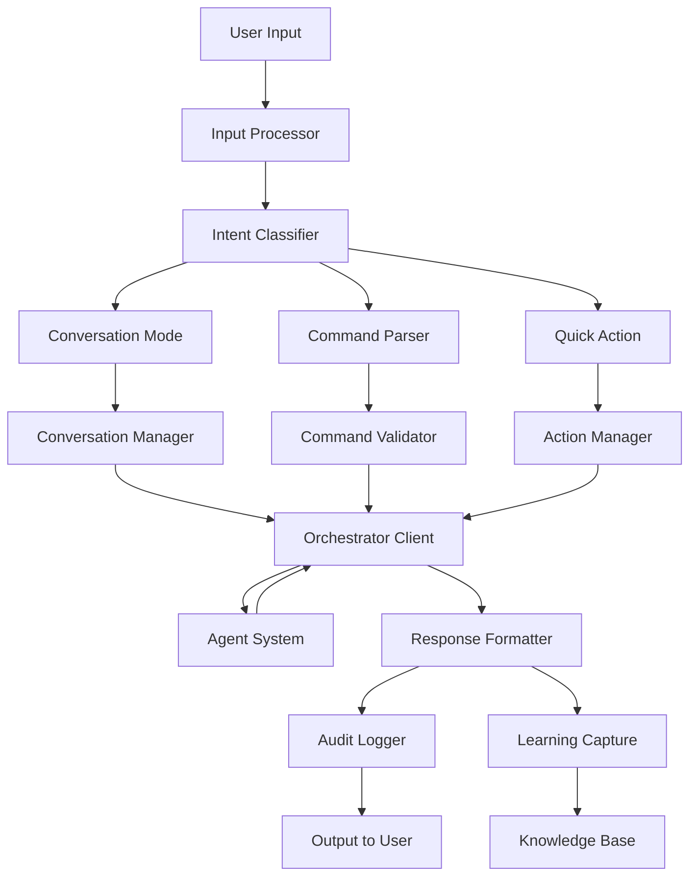

# COMPASS Human-AI Interface Architecture

## Executive Summary

This document defines the architecture for COMPASS's human-AI interface system, designed to democratize incident investigation while promoting a learning culture. The interface implements a "Natural Language First" approach with progressive enhancement, enabling both Product Owners and Senior Engineers to effectively investigate incidents without extensive training. Every interaction is auditable, every decision is captured with context, and the system actively promotes psychological safety through Learning Teams methodology.

The interface serves as the primary interaction layer between human operators and COMPASS's multi-agent investigation system, translating natural language queries into scientific investigations while preserving human agency and capturing organizational learning.

## 1. Design Principles

### 1.1 Core Principles

```python
class InterfacePrinciples(Enum):
    """Non-negotiable principles governing all interface decisions"""
    
    ACCESSIBILITY_FIRST = "Anyone can use it without training"
    PROGRESSIVE_ENHANCEMENT = "Power grows with expertise, not required from start"
    PSYCHOLOGICAL_SAFETY = "No blame, focus on learning and improvement"
    COMPLETE_AUDITABILITY = "Every action recorded with context and reasoning"
    HUMAN_AGENCY = "Humans decide, AI advises and accelerates"
    CULTURAL_ALIGNMENT = "Actively promotes Learning Teams methodology"
    SCIENTIFIC_RIGOR = "Hypotheses, evidence, and systematic investigation"
```

### 1.2 Learning Teams Integration

Following research showing Learning Teams generate **114% more improvement actions** with **57% system focus** versus 30% for traditional RCA:

- **Questions asked**: "What made sense at the time?" not "Why did you make that error?"
- **Participation**: All relevant staff involved, not just those in the incident
- **Focus**: How work normally happens, not what went wrong
- **Outcome**: System improvements, not person-focused actions

### 1.3 Cognitive Load Management

Based on cognitive load research:
- **Reduce extraneous load**: Progressive disclosure of information
- **Manage intrinsic load**: Break complex investigations into clear phases
- **Support germane load**: Help users build mental models of the system

## 2. System Architecture

### 2.1 High-Level Architecture

```python
from dataclasses import dataclass
from typing import Protocol, Optional, List, Dict, Any
from enum import Enum
import asyncio

class InterfaceLayer:
    """
    Primary interface layer for COMPASS
    Handles all human-AI interactions with multiple modalities
    """
    
    def __init__(self):
        # Core Components
        self.input_processor = MultiModalInputProcessor()
        self.intent_classifier = IntentClassifier()
        self.conversation_manager = ConversationManager()
        self.command_parser = CommandParser()
        self.response_formatter = AdaptiveResponseFormatter()
        
        # State Management
        self.session_manager = SessionManager()
        self.user_profile_store = UserProfileStore()
        self.investigation_state = InvestigationStateManager()
        
        # Safety & Audit
        self.audit_logger = AuditLogger()
        self.safety_checker = SafetyChecker()
        self.decision_recorder = HumanDecisionRecorder()
        
        # Integration Points
        self.orchestrator_client = OrchestratorClient()
        self.knowledge_base = EnterpriseKnowledgeBase()
        self.learning_capture = LearningCaptureSystem()
```

### 2.2 Component Interaction Flow



## 3. Input Processing System

### 3.1 Multi-Modal Input Handler

```python
@dataclass
class UserInput:
    """Represents any form of user input"""
    raw_text: str
    input_type: InputType
    context: ConversationContext
    metadata: InputMetadata
    
class InputType(Enum):
    NATURAL_LANGUAGE = "natural"      # "Help, product-service is down!"
    STRUCTURED_COMMAND = "command"    # "compass investigate --service product"
    QUICK_ACTION = "action"           # Button clicks, menu selections
    CONTINUATION = "continuation"     # Follow-up to previous interaction

class MultiModalInputProcessor:
    """
    Processes all forms of user input
    Maintains context across interaction modes
    """
    
    async def process_input(
        self, 
        raw_input: str,
        session: Session
    ) -> ProcessedInput:
        # Clean and normalize input
        cleaned = self._sanitize_input(raw_input)
        
        # Detect input type
        input_type = self._classify_input_type(cleaned)
        
        # Extract context markers
        context_markers = self._extract_context_markers(cleaned, session)
        
        # Handle urgent markers
        if self._contains_urgency_markers(cleaned):
            return ProcessedInput(
                original=raw_input,
                cleaned=cleaned,
                type=input_type,
                urgency=UrgencyLevel.CRITICAL,
                intent=Intent.INVESTIGATE_IMMEDIATE,
                context=context_markers
            )
        
        return ProcessedInput(
            original=raw_input,
            cleaned=cleaned,
            type=input_type,
            urgency=self._assess_urgency(cleaned, session),
            intent=await self._classify_intent(cleaned, session),
            context=context_markers
        )
    
    def _contains_urgency_markers(self, text: str) -> bool:
        """Check for panic/urgent language"""
        urgent_markers = [
            "down", "critical", "emergency", "help", "urgent",
            "ASAP", "immediately", "broken", "failing", "crashed"
        ]
        return any(marker in text.lower() for marker in urgent_markers)
```

### 3.2 Intent Classification System

```python
class Intent(Enum):
    """All possible user intents"""
    # Investigation
    INVESTIGATE_INCIDENT = "investigate"
    INVESTIGATE_SPECIFIC = "investigate_specific"
    
    # Questions
    QUESTION_STATUS = "status_question"
    QUESTION_EXPLANATION = "explanation_request"
    QUESTION_HISTORICAL = "historical_query"
    
    # Commands
    COMMAND_HYPOTHESIS = "hypothesis_command"
    COMMAND_FOCUS = "focus_command"
    COMMAND_OVERRIDE = "override_command"
    
    # Learning
    LEARNING_CAPTURE = "capture_learning"
    LEARNING_REVIEW = "review_past"
    
    # Meta
    HELP_REQUEST = "help"
    FEEDBACK = "feedback"

class IntentClassifier:
    """
    ML-based intent classification with fallback patterns
    Uses fine-tuned model for conversation classification
    """
    
    def __init__(self):
        self.ml_classifier = self._load_intent_model()
        self.pattern_matcher = PatternMatcher()
        self.context_analyzer = ContextAnalyzer()
    
    async def classify_intent(
        self,
        processed_input: ProcessedInput,
        session: Session
    ) -> ClassifiedIntent:
        # Try ML classification first
        ml_result = await self._ml_classify(processed_input)
        
        if ml_result.confidence > 0.8:
            return ml_result
        
        # Fall back to pattern matching for ambiguous cases
        pattern_result = self.pattern_matcher.match(processed_input)
        
        # Use context to disambiguate
        final_intent = self.context_analyzer.resolve(
            ml_result,
            pattern_result,
            session.history
        )
        
        return ClassifiedIntent(
            primary=final_intent,
            confidence=max(ml_result.confidence, pattern_result.confidence),
            alternatives=self._get_alternatives(ml_result, pattern_result)
        )
```

## 4. Conversation Management

### 4.1 Adaptive Conversation Engine

```python
class ConversationManager:
    """
    Manages natural language conversations with adaptive complexity
    Maintains context across multi-turn interactions
    """
    
    def __init__(self):
        self.dialogue_state = DialogueStateTracker()
        self.complexity_adapter = ComplexityAdapter()
        self.clarification_manager = ClarificationManager()
        self.context_window = ContextWindow(max_turns=10)
    
    async def handle_conversation(
        self,
        intent: ClassifiedIntent,
        session: Session
    ) -> ConversationResponse:
        # Update dialogue state
        self.dialogue_state.update(intent, session)
        
        # Determine appropriate complexity level
        complexity = self.complexity_adapter.determine_level(
            user_profile=session.user_profile,
            incident_severity=session.incident_context.severity,
            interaction_count=session.interaction_count
        )
        
        # Generate response based on intent and complexity
        if intent.primary == Intent.INVESTIGATE_INCIDENT:
            return await self._handle_investigation_request(
                intent, session, complexity
            )
        elif intent.primary == Intent.QUESTION_EXPLANATION:
            return await self._handle_explanation_request(
                intent, session, complexity
            )
        elif intent.needs_clarification:
            return await self._handle_clarification(
                intent, session
            )
        
        # Default response generation
        return await self._generate_contextual_response(
            intent, session, complexity
        )
    
    async def _handle_investigation_request(
        self,
        intent: ClassifiedIntent,
        session: Session,
        complexity: ComplexityLevel
    ) -> ConversationResponse:
        """
        Handle investigation requests with appropriate detail level
        Example: 'Help, product-service has high error rates!'
        """
        
        # Start investigation via orchestrator
        investigation_id = await self.orchestrator_client.start_investigation(
            service=intent.extracted_entities.get('service'),
            symptoms=intent.extracted_entities.get('symptoms'),
            urgency=intent.urgency
        )
        
        # Format response based on complexity
        if complexity == ComplexityLevel.EMERGENCY:
            # Terse, action-focused
            return ConversationResponse(
                text=f"Investigating {intent.extracted_entities.get('service')}. "
                     f"3 hypotheses identified. Highest confidence: "
                     f"Feature flag misconfiguration (78%). "
                     f"Fix: Roll back flag 'new-checkout'? [yes/no/details]",
                quick_actions=["yes", "no", "show details", "other hypotheses"],
                investigation_id=investigation_id
            )
        
        elif complexity == ComplexityLevel.LEARNING:
            # Educational, verbose
            return ConversationResponse(
                text=f"""
                I'll help you investigate the {intent.extracted_entities.get('service')} issue.
                
                Here's what I'm doing:
                1. **Observing**: Gathering metrics, logs, and recent changes
                2. **Hypothesizing**: Forming theories about what could cause this
                3. **Testing**: Systematically validating each hypothesis
                4. **Learning**: Capturing insights for future incidents
                
                Initial observations:
                • Error rate increased from 0.5% to 47% at 14:31 UTC
                • Deployment detected: Feature flag 'new-checkout' at 14:30 UTC
                • Pattern matches 3 previous incidents
                
                Would you like me to:
                a) Explain what I'm seeing in detail
                b) Just show me the most likely cause
                c) Teach me how to investigate this myself
                """,
                quick_actions=["a", "b", "c", "Continue investigation"],
                investigation_id=investigation_id
            )
        
        else:  # NORMAL complexity
            return ConversationResponse(
                text=f"""
                Investigating {intent.extracted_entities.get('service')} errors.
                
                📊 Current Status:
                • Error rate: 47% (baseline: 0.5%)
                • Started: 14:31 UTC (5 minutes ago)
                • Affected: /api/checkout, /api/payment endpoints
                
                🔬 Top Hypotheses:
                1. Feature flag 'new-checkout' misconfiguration (78% confidence)
                   → Deployment aligns with error spike
                2. Database connection exhaustion (41% confidence)
                   → Monday pattern, but pools look normal
                3. Payment service degradation (23% confidence)
                   → Checking external dependencies...
                
                What would you like to focus on, or should I continue investigating all paths?
                """,
                quick_actions=[
                    "Focus on feature flag",
                    "Check all hypotheses",
                    "Show me the evidence",
                    "What do you recommend?"
                ],
                investigation_id=investigation_id
            )
```

### 4.2 Complexity Adaptation System

```python
class ComplexityLevel(Enum):
    EMERGENCY = "emergency"    # Critical incident, experienced user
    NORMAL = "normal"         # Standard investigation
    LEARNING = "learning"     # New user or training mode
    EXPERT = "expert"         # Power user, wants details

class ComplexityAdapter:
    """
    Dynamically adjusts response complexity based on context
    Learns user preferences over time
    """
    
    def determine_level(
        self,
        user_profile: UserProfile,
        incident_severity: Severity,
        interaction_count: int
    ) -> ComplexityLevel:
        # Emergency overrides all other factors
        if incident_severity == Severity.CRITICAL and user_profile.prefers_speed:
            return ComplexityLevel.EMERGENCY
        
        # New users get learning mode
        if user_profile.total_investigations < 5:
            return ComplexityLevel.LEARNING
        
        # Expert users who've shown preference for details
        if user_profile.average_interaction_depth > 10:
            return ComplexityLevel.EXPERT
        
        # Adapt based on recent interactions
        if interaction_count > 5 and user_profile.questions_asked > 3:
            # They need more explanation
            return ComplexityLevel.LEARNING
        
        return ComplexityLevel.NORMAL
    
    def adjust_in_conversation(
        self,
        user_feedback: str,
        current_level: ComplexityLevel
    ) -> ComplexityLevel:
        """Adjust complexity based on user cues"""
        
        simplify_markers = ["just tell me", "quickly", "summary", "tl;dr"]
        detail_markers = ["explain", "why", "how", "teach me", "details"]
        
        if any(marker in user_feedback.lower() for marker in simplify_markers):
            return ComplexityLevel.EMERGENCY
        
        if any(marker in user_feedback.lower() for marker in detail_markers):
            return ComplexityLevel.LEARNING
        
        return current_level
```

## 5. Command Processing System

### 5.1 Structured Command Parser

```python
class CommandParser:
    """
    Parses structured commands for power users
    Provides autocomplete and validation
    """
    
    def __init__(self):
        self.command_registry = self._build_command_registry()
        self.validator = CommandValidator()
        self.autocomplete = AutocompleteEngine()
    
    def _build_command_registry(self) -> Dict[str, Command]:
        """Register all available commands"""
        return {
            # Investigation commands
            "investigate": InvestigateCommand(),
            "hypothesis": HypothesisCommand(),
            "test": TestHypothesisCommand(),
            "focus": FocusCommand(),
            
            # Data commands
            "show": ShowCommand(),
            "explain": ExplainCommand(),
            "evidence": EvidenceCommand(),
            
            # Learning commands
            "capture": CaptureLearningCommand(),
            "review": ReviewCommand(),
            
            # Control commands
            "override": OverrideCommand(),
            "escalate": EscalateCommand(),
            "stop": StopCommand(),
        }
    
    async def parse_command(
        self,
        command_text: str,
        session: Session
    ) -> ParsedCommand:
        """
        Parse structured command with validation
        Example: 'hypothesis add --description "Cache invalidation" --confidence 0.7'
        """
        
        parts = shlex.split(command_text)
        
        if not parts:
            raise CommandParseError("Empty command")
        
        command_name = parts[0]
        
        if command_name not in self.command_registry:
            suggestions = self.autocomplete.suggest(command_name)
            raise CommandParseError(
                f"Unknown command '{command_name}'. "
                f"Did you mean: {', '.join(suggestions)}?"
            )
        
        command = self.command_registry[command_name]
        
        # Parse arguments
        args, kwargs = self._parse_arguments(parts[1:])
        
        # Validate command
        validation_result = await self.validator.validate(
            command, args, kwargs, session
        )
        
        if not validation_result.is_valid:
            raise CommandValidationError(validation_result.errors)
        
        return ParsedCommand(
            command=command,
            args=args,
            kwargs=kwargs,
            raw=command_text
        )
```

### 5.2 Command Execution Engine

```python
class CommandExecutor:
    """
    Executes parsed commands with full audit trail
    Integrates with orchestrator and agent system
    """
    
    async def execute(
        self,
        parsed_command: ParsedCommand,
        session: Session
    ) -> CommandResult:
        # Pre-execution audit
        execution_id = await self.audit_logger.log_command_start(
            command=parsed_command,
            user=session.user,
            context=session.investigation_context
        )
        
        try:
            # Check permissions
            if not await self._check_permissions(parsed_command, session):
                raise PermissionError(
                    f"User {session.user} lacks permission for {parsed_command.command.name}"
                )
            
            # Execute command
            result = await parsed_command.command.execute(
                args=parsed_command.args,
                kwargs=parsed_command.kwargs,
                context=ExecutionContext(
                    session=session,
                    orchestrator=self.orchestrator_client,
                    knowledge_base=self.knowledge_base
                )
            )
            
            # Post-execution audit
            await self.audit_logger.log_command_success(
                execution_id=execution_id,
                result=result
            )
            
            return result
            
        except Exception as e:
            # Audit failure
            await self.audit_logger.log_command_failure(
                execution_id=execution_id,
                error=e
            )
            raise
```

## 6. Human Decision Capture System

### 6.1 Decision Point Model

```python
@dataclass
class HumanDecisionPoint:
    """
    Captures complete context when human judgment is required
    Makes human decisions first-class entities for learning
    """
    # Identity
    id: str
    timestamp: datetime
    decision_type: DecisionType
    
    # Context presented to human
    presented_hypotheses: List[Hypothesis]
    ai_recommendation: Optional[Hypothesis]
    ai_confidence: float
    ai_reasoning: str
    evidence_summary: Dict[str, Any]
    
    # Investigation state
    investigation_id: str
    incident_context: IncidentContext
    time_pressure: Optional[timedelta]
    constraints: List[Constraint]  # Budget, SLO, etc.
    
    # Human decision
    operator: UserIdentity
    decision: Any
    reasoning: str  # WHY they made this choice
    confidence: ConfidenceLevel
    time_to_decide: timedelta
    
    # Agreement analysis
    agrees_with_ai: bool
    disagreement_reason: Optional[str]
    
    # Outcome (filled later)
    outcome: Optional[DecisionOutcome]
    was_effective: Optional[bool]
    lessons_learned: List[str]
    
    # Collaboration
    consulted_with: List[UserIdentity]
    additional_data_requested: List[str]
    
    def to_learning_point(self) -> LearningPoint:
        """Convert decision to learning for knowledge base"""
        return LearningPoint(
            context=self.incident_context,
            situation="Human chose " + str(self.decision),
            reasoning=self.reasoning,
            outcome=self.outcome,
            lesson="When facing " + self.decision_type + 
                   ", consider " + self.reasoning
        )

class DecisionType(Enum):
    HYPOTHESIS_SELECTION = "Which hypothesis to pursue"
    HYPOTHESIS_OVERRIDE = "Rejecting AI recommendation"
    ESCALATION_DECISION = "Whether to escalate"
    ACTION_APPROVAL = "Approving remediation action"
    INVESTIGATION_DIRECTION = "Changing investigation strategy"
    RESOURCE_ALLOCATION = "Allocating investigation resources"
```

### 6.2 Decision Capture Interface

```python
class DecisionCaptureInterface:
    """
    Rich interface for capturing human decisions with context
    Ensures reasoning is always captured, not just choices
    """
    
    async def capture_decision(
        self,
        decision_point: DecisionPoint,
        session: Session
    ) -> CapturedDecision:
        # Present context clearly
        context_display = self._format_context(decision_point)
        
        # Show AI recommendation if available
        if decision_point.ai_recommendation:
            ai_display = self._format_ai_recommendation(
                decision_point.ai_recommendation,
                decision_point.ai_confidence,
                decision_point.ai_reasoning
            )
        else:
            ai_display = "No AI recommendation available"
        
        # Get human's choice
        choice = await self._get_choice(
            options=decision_point.options,
            context=context_display,
            ai_recommendation=ai_display
        )
        
        # CRITICAL: Capture reasoning
        reasoning = await self._capture_reasoning(choice, decision_point)
        
        # Capture confidence
        confidence = await self._capture_confidence()
        
        # Check for agreement with AI
        agrees_with_ai = (
            choice == decision_point.ai_recommendation 
            if decision_point.ai_recommendation else None
        )
        
        # If disagreement, capture why
        disagreement_reason = None
        if agrees_with_ai == False:
            disagreement_reason = await self._capture_disagreement_reason()
        
        # Record decision
        return CapturedDecision(
            decision_point_id=decision_point.id,
            operator=session.user,
            choice=choice,
            reasoning=reasoning,
            confidence=confidence,
            agrees_with_ai=agrees_with_ai,
            disagreement_reason=disagreement_reason,
            time_to_decide=self._calculate_decision_time(),
            consulted_with=await self._get_consultations()
        )
    
    async def _capture_reasoning(
        self,
        choice: Any,
        decision_point: DecisionPoint
    ) -> str:
        """
        Ensure we always capture WHY the human made their choice
        This is critical for learning and improvement
        """
        
        # Adaptive prompts based on decision type
        if decision_point.type == DecisionType.HYPOTHESIS_OVERRIDE:
            prompt = f"""
            You chose {choice} instead of the AI recommendation.
            What information or experience led you to this decision?
            (This helps us learn and improve the system)
            """
        else:
            prompt = f"""
            You chose: {choice}
            Brief reasoning (what made this the right choice?):
            """
        
        reasoning = await self._get_text_input(prompt)
        
        # Ensure minimum quality
        while len(reasoning.split()) < 5:
            follow_up = """
            Could you elaborate a bit more? Even a sentence or two helps.
            For example: 'Based on past incidents...' or 'The pattern suggests...'
            """
            reasoning = await self._get_text_input(follow_up)
        
        return reasoning
```

## 7. Response Formatting System

### 7.1 Adaptive Response Formatter

```python
class AdaptiveResponseFormatter:
    """
    Formats responses based on user preferences and context
    Supports multiple output formats while maintaining consistency
    """
    
    def __init__(self):
        self.formatters = {
            OutputFormat.CONVERSATIONAL: ConversationalFormatter(),
            OutputFormat.STRUCTURED: StructuredFormatter(),
            OutputFormat.VISUAL: VisualFormatter(),
            OutputFormat.EMERGENCY: EmergencyFormatter()
        }
        self.markdown_renderer = MarkdownRenderer()
        self.terminal_renderer = TerminalRenderer()
    
    async def format_response(
        self,
        content: ResponseContent,
        session: Session,
        format_preference: OutputFormat = None
    ) -> FormattedResponse:
        # Determine format
        format_type = format_preference or self._determine_format(
            content, session
        )
        
        # Apply safety checks
        safe_content = await self.safety_checker.sanitize(content)
        
        # Format based on type
        formatter = self.formatters[format_type]
        formatted = await formatter.format(safe_content, session)
        
        # Add interactive elements if appropriate
        if session.interface_type == InterfaceType.WEB:
            formatted = self._add_interactive_elements(formatted)
        
        # Add audit trail reference
        formatted.audit_reference = content.audit_id
        
        return formatted
    
    def _determine_format(
        self,
        content: ResponseContent,
        session: Session
    ) -> OutputFormat:
        """Intelligently determine best format"""
        
        if session.incident_severity == Severity.CRITICAL:
            return OutputFormat.EMERGENCY
        
        if content.type == ContentType.HYPOTHESIS_TREE:
            return OutputFormat.VISUAL
        
        if session.user_profile.prefers_structure:
            return OutputFormat.STRUCTURED
        
        return OutputFormat.CONVERSATIONAL
```

### 7.2 Output Templates

```python
class ConversationalFormatter:
    """Natural, friendly conversation format"""
    
    def format_investigation_status(
        self,
        investigation: Investigation
    ) -> str:
        return f"""
        I'm investigating {investigation.service} and have made good progress.
        
        Here's what I've found:
        • The issue started at {investigation.start_time.strftime('%H:%M')}
        • It's affecting {investigation.impact_description}
        • I have {len(investigation.active_hypotheses)} theories about the cause
        
        My best guess right now is {investigation.top_hypothesis.description} 
        ({investigation.top_hypothesis.confidence:.0%} confident) because 
        {investigation.top_hypothesis.primary_evidence}.
        
        Should I focus on this, or would you like to explore other possibilities?
        """

class StructuredFormatter:
    """Clear, organized structure for those who prefer it"""
    
    def format_investigation_status(
        self,
        investigation: Investigation
    ) -> str:
        return f"""
        ## Investigation Status: {investigation.id}
        
        **Service:** {investigation.service}
        **Status:** {investigation.status}
        **Duration:** {investigation.duration} minutes
        **Cost:** ${investigation.cost:.2f}
        
        ### Hypotheses (Ranked by Confidence)
        
        1. **{investigation.hypotheses[0].description}** [{investigation.hypotheses[0].confidence:.0%}]
           - Evidence: {investigation.hypotheses[0].evidence_summary}
           - Next Test: {investigation.hypotheses[0].next_test}
        
        2. **{investigation.hypotheses[1].description}** [{investigation.hypotheses[1].confidence:.0%}]
           - Evidence: {investigation.hypotheses[1].evidence_summary}
           - Next Test: {investigation.hypotheses[1].next_test}
        
        ### Recommended Action
        {investigation.recommended_action}
        
        [Approve] [Modify] [Investigate Further]
        """

class EmergencyFormatter:
    """Terse, action-focused for critical incidents"""
    
    def format_investigation_status(
        self,
        investigation: Investigation
    ) -> str:
        return f"""
        SERVICE DOWN: {investigation.service}
        TOP CAUSE: {investigation.top_hypothesis.description} [{investigation.top_hypothesis.confidence:.0%}]
        FIX: {investigation.top_hypothesis.remediation}
        TIME TO RECOVER: ~{investigation.estimated_recovery_time} min
        
        Execute fix? [Y/n]:
        """
```

## 8. Audit and Transparency System

### 8.1 Comprehensive Audit Logger

```python
class AuditLogger:
    """
    Records every interaction with complete context
    Ensures full traceability for compliance and learning
    """
    
    def __init__(self):
        self.storage = AuditStorage()
        self.encryption = AuditEncryption()
        self.retention_policy = RetentionPolicy(days=2555)  # 7 years
    
    async def log_interaction(
        self,
        interaction: Interaction
    ) -> AuditEntry:
        entry = AuditEntry(
            id=generate_audit_id(),
            timestamp=datetime.utcnow(),
            
            # User info
            user_id=interaction.user.id,
            user_role=interaction.user.role,
            
            # Input
            input_raw=interaction.input_raw,
            input_processed=interaction.input_processed,
            input_intent=interaction.classified_intent,
            
            # Processing
            processing_time=interaction.processing_time,
            ai_operations=interaction.ai_operations,
            tokens_used=interaction.token_count,
            cost=interaction.estimated_cost,
            
            # Decision points
            decisions_required=interaction.decision_points,
            decisions_made=interaction.human_decisions,
            
            # Output
            response=interaction.response,
            actions_taken=interaction.actions,
            
            # Context
            incident_id=interaction.incident_id,
            investigation_id=interaction.investigation_id,
            
            # Compliance
            compliance_flags=self._check_compliance(interaction)
        )
        
        # Encrypt sensitive data
        encrypted = await self.encryption.encrypt(entry)
        
        # Store with redundancy
        await self.storage.store(encrypted)
        
        # Real-time streaming for monitoring
        await self.stream_to_monitoring(entry)
        
        return entry
    
    async def generate_audit_report(
        self,
        investigation_id: str,
        include_decisions: bool = True
    ) -> AuditReport:
        """Generate human-readable audit report"""
        
        entries = await self.storage.get_by_investigation(investigation_id)
        
        return AuditReport(
            investigation_id=investigation_id,
            total_interactions=len(entries),
            total_decisions=sum(len(e.decisions_made) for e in entries),
            timeline=self._build_timeline(entries),
            decision_analysis=self._analyze_decisions(entries) if include_decisions else None,
            cost_breakdown=self._calculate_costs(entries),
            compliance_status=self._verify_compliance(entries)
        )
```

### 8.2 Transparency Interface

```python
class TransparencyInterface:
    """
    Makes AI reasoning and decision-making visible to users
    Builds trust through explainability
    """
    
    async def explain_reasoning(
        self,
        hypothesis: Hypothesis,
        level_of_detail: DetailLevel = DetailLevel.NORMAL
    ) -> Explanation:
        """Explain why AI reached this conclusion"""
        
        if level_of_detail == DetailLevel.SIMPLE:
            return Explanation(
                summary=f"I think it's {hypothesis.description} because "
                       f"{hypothesis.primary_evidence.description}.",
                confidence_reason=f"I'm {hypothesis.confidence:.0%} sure based on "
                                f"{len(hypothesis.evidence)} pieces of evidence."
            )
        
        elif level_of_detail == DetailLevel.DETAILED:
            return Explanation(
                summary=hypothesis.description,
                reasoning_chain=[
                    f"1. Observed: {obs.description} (Weight: {obs.weight})"
                    for obs in hypothesis.observations
                ],
                evidence_analysis=self._analyze_evidence(hypothesis.evidence),
                confidence_calculation=self._explain_confidence(hypothesis),
                alternative_explanations=self._explain_alternatives(hypothesis),
                assumptions=hypothesis.assumptions,
                limitations=hypothesis.limitations
            )
        
        return Explanation(
            summary=hypothesis.description,
            key_evidence=hypothesis.top_evidence[:3],
            confidence=hypothesis.confidence,
            test_results=hypothesis.test_results
        )
    
    async def show_investigation_tree(
        self,
        investigation: Investigation
    ) -> InvestigationVisualization:
        """Show complete investigation path including dead ends"""
        
        return InvestigationVisualization(
            active_paths=[
                self._format_hypothesis_path(h) 
                for h in investigation.active_hypotheses
            ],
            abandoned_paths=[
                self._format_abandoned_path(h, reason)
                for h, reason in investigation.abandoned_hypotheses
            ],
            learnings=[
                self._format_learning(l)
                for l in investigation.captured_learnings
            ],
            decision_points=[
                self._format_decision_point(d)
                for d in investigation.human_decisions
            ]
        )
```

## 9. Safety and Culture System

### 9.1 Psychological Safety Manager

```python
class PsychologicalSafetyManager:
    """
    Ensures interface promotes learning culture
    Implements Learning Teams methodology
    """
    
    def __init__(self):
        self.blame_detector = BlameLanguageDetector()
        self.question_reframer = QuestionReframer()
        self.learning_prompter = LearningPrompter()
    
    async def ensure_safe_interaction(
        self,
        interaction: Interaction
    ) -> SafeInteraction:
        """Transform interactions to promote psychological safety"""
        
        # Detect and reframe blame language
        if self.blame_detector.contains_blame(interaction.text):
            safe_text = self.question_reframer.reframe_to_learning(
                interaction.text
            )
            
            # Gentle education
            education = """
            I've reframed that slightly to focus on learning rather than blame.
            Instead of 'Who broke this?', we ask 'What can we learn?'
            """
            
            return SafeInteraction(
                original=interaction.text,
                reframed=safe_text,
                education=education
            )
        
        return SafeInteraction(original=interaction.text)
    
    def reframe_questions(self, questions: List[str]) -> List[str]:
        """Reframe questions to promote learning"""
        
        reframing_map = {
            "Who caused this?": "What factors contributed to this?",
            "Why didn't you catch this?": "What made this hard to detect?",
            "Whose fault is this?": "What can we learn from this?",
            "Why did you do that?": "What made that seem like the right choice?",
            "Who made this mistake?": "How did our system allow this?",
        }
        
        return [
            reframing_map.get(q, q) for q in questions
        ]
    
    async def facilitate_learning_review(
        self,
        incident: Incident,
        participants: List[User]
    ) -> LearningReview:
        """Facilitate blameless post-incident review"""
        
        return LearningReview(
            opening="Let's learn from this incident together. "
                   "Remember: we're looking at systems, not people.",
            
            questions=[
                "What went well during this incident?",
                "What made sense at the time but didn't work out?",
                "What surprised us?",
                "What would help next time?",
                "What patterns have we seen before?",
            ],
            
            participation_prompts=[
                f"@{p.name}, you were involved in {p.role}. "
                f"What did you observe from your perspective?"
                for p in participants
            ],
            
            learning_capture_template="""
            ## What We Learned
            
            ### Work-As-Done vs Work-As-Imagined
            - How work actually happens: ___________
            - How we thought it happened: __________
            - Gap because: ________________________
            
            ### Contributing Factors (System Level)
            1. ____________________________________
            2. ____________________________________
            3. ____________________________________
            
            ### Improvements (No names, just systems)
            1. ____________________________________
            2. ____________________________________
            3. ____________________________________
            """
        )
```

### 9.2 Learning Capture System

```python
class LearningCaptureSystem:
    """
    Captures organizational learning from every incident
    Builds knowledge base for future investigations
    """
    
    async def capture_learning(
        self,
        incident: Incident,
        investigation: Investigation,
        review: LearningReview
    ) -> CapturedLearning:
        # Extract learnings from multiple sources
        learnings = []
        
        # From investigation path
        learnings.extend(
            self._extract_from_investigation(investigation)
        )
        
        # From human decisions
        learnings.extend(
            self._extract_from_decisions(investigation.human_decisions)
        )
        
        # From failed hypotheses
        learnings.extend(
            self._extract_from_failures(investigation.disproven_hypotheses)
        )
        
        # From review discussion
        learnings.extend(
            self._extract_from_review(review)
        )
        
        # Categorize by system level
        categorized = self._categorize_learnings(learnings)
        
        # Generate actionable improvements
        improvements = await self._generate_improvements(categorized)
        
        # Update knowledge base
        await self.knowledge_base.add_learnings(
            incident_type=incident.type,
            learnings=categorized,
            improvements=improvements
        )
        
        return CapturedLearning(
            incident_id=incident.id,
            learnings=learnings,
            improvements=improvements,
            patterns_identified=self._identify_patterns(learnings),
            knowledge_base_updates=len(learnings)
        )
    
    def _extract_from_failures(
        self,
        disproven: List[Hypothesis]
    ) -> List[Learning]:
        """Failed hypotheses are valuable learning artifacts"""
        
        learnings = []
        
        for hypothesis in disproven:
            learning = Learning(
                type=LearningType.DISPROVEN_PATH,
                description=f"Hypothesis '{hypothesis.description}' seemed "
                          f"likely because {hypothesis.initial_evidence} but "
                          f"was disproven by {hypothesis.disproof_evidence}",
                
                system_level=SystemLevel.TECHNICAL,
                
                future_guidance=f"When seeing {hypothesis.initial_pattern}, "
                               f"also check {hypothesis.disproof_test} before "
                               f"concluding {hypothesis.description}",
                
                confidence=0.8,
                
                metadata={
                    'hypothesis_id': hypothesis.id,
                    'disproof_test': hypothesis.disproof_test,
                    'false_positive_pattern': hypothesis.initial_pattern
                }
            )
            learnings.append(learning)
        
        return learnings
```

## 10. Integration Points

### 10.1 Orchestrator Integration

```python
class OrchestratorClient:
    """
    Interface to COMPASS orchestrator and agent system
    Manages all AI agent interactions
    """
    
    async def start_investigation(
        self,
        service: str,
        symptoms: List[str],
        urgency: UrgencyLevel
    ) -> InvestigationHandle:
        """Start new investigation with orchestrator"""
        
        request = InvestigationRequest(
            service=service,
            symptoms=symptoms,
            urgency=urgency,
            requester=self.current_user,
            context=self.build_context()
        )
        
        response = await self.orchestrator.create_investigation(request)
        
        # Subscribe to updates
        await self.subscribe_to_updates(response.investigation_id)
        
        return InvestigationHandle(
            id=response.investigation_id,
            status_endpoint=response.status_url,
            update_stream=response.websocket_url
        )
    
    async def get_hypotheses(
        self,
        investigation_id: str
    ) -> List[Hypothesis]:
        """Get current hypotheses from orchestrator"""
        
        response = await self.orchestrator.get_hypotheses(investigation_id)
        
        return [
            self._map_hypothesis(h) for h in response.hypotheses
        ]
    
    async def submit_human_decision(
        self,
        decision: CapturedDecision
    ) -> None:
        """Send human decision back to orchestrator"""
        
        await self.orchestrator.record_decision(
            investigation_id=decision.investigation_id,
            decision_type=decision.type,
            choice=decision.choice,
            reasoning=decision.reasoning,
            operator=decision.operator
        )
```

### 10.2 Knowledge Base Integration

```python
class EnterpriseKnowledgeBase:
    """
    Interface to enterprise knowledge and learning repository
    Provides context and historical patterns
    """
    
    async def get_relevant_context(
        self,
        service: str,
        symptoms: List[str]
    ) -> RelevantContext:
        """Retrieve relevant historical context"""
        
        # Search for similar incidents
        similar = await self.search_similar_incidents(
            service=service,
            symptoms=symptoms,
            limit=5
        )
        
        # Get service-specific knowledge
        service_knowledge = await self.get_service_knowledge(service)
        
        # Get recent learnings
        recent_learnings = await self.get_recent_learnings(
            service=service,
            days=30
        )
        
        return RelevantContext(
            similar_incidents=similar,
            service_patterns=service_knowledge.patterns,
            known_issues=service_knowledge.known_issues,
            recent_learnings=recent_learnings,
            runbooks=service_knowledge.runbooks
        )
    
    async def search_similar_incidents(
        self,
        service: str,
        symptoms: List[str],
        limit: int = 5
    ) -> List[SimilarIncident]:
        """Find similar past incidents using semantic search"""
        
        # Build embedding from symptoms
        query_embedding = await self.embedder.embed(
            f"Service: {service}, Symptoms: {', '.join(symptoms)}"
        )
        
        # Semantic search
        results = await self.vector_store.search(
            embedding=query_embedding,
            filter={'service': service},
            limit=limit
        )
        
        return [
            SimilarIncident(
                id=r.incident_id,
                similarity=r.score,
                summary=r.summary,
                resolution=r.resolution,
                learnings=r.learnings
            )
            for r in results
        ]
```

## 11. Implementation Guidelines

### 11.1 Technology Stack

```python
TECHNOLOGY_STACK = {
    # Core Framework
    'backend': 'FastAPI',  # Async, WebSocket support, OpenAPI
    'frontend': 'React + TypeScript',  # For visual canvas if needed
    
    # Natural Language
    'nlp': 'OpenAI GPT-4',  # Intent classification and generation
    'embeddings': 'text-embedding-ada-002',  # Semantic search
    
    # Data Storage
    'session_store': 'Redis',  # Fast session management
    'audit_store': 'PostgreSQL',  # Long-term audit storage
    'vector_store': 'Pinecone',  # Semantic search for knowledge base
    
    # Real-time
    'websocket': 'FastAPI WebSocket',  # Real-time updates
    'event_stream': 'Server-Sent Events',  # Alternative to WebSocket
    
    # Monitoring
    'metrics': 'Prometheus',  # Metrics collection
    'tracing': 'OpenTelemetry',  # Distributed tracing
    'logging': 'Structured Logging (JSON)',  # Searchable logs
}
```

### 11.2 Deployment Architecture

```yaml
# docker-compose.yml
version: '3.8'

services:
  interface-api:
    image: compass-interface:latest
    environment:
      - ORCHESTRATOR_URL=http://orchestrator:8000
      - REDIS_URL=redis://redis:6379
      - DATABASE_URL=postgresql://...
    ports:
      - "8080:8080"
    healthcheck:
      test: ["CMD", "curl", "-f", "http://localhost:8080/health"]
      interval: 30s
      timeout: 10s
      retries: 3
  
  redis:
    image: redis:7-alpine
    volumes:
      - redis-data:/data
  
  postgres:
    image: postgres:15
    environment:
      - POSTGRES_DB=compass_audit
    volumes:
      - postgres-data:/var/lib/postgresql/data
  
  prometheus:
    image: prom/prometheus:latest
    volumes:
      - ./prometheus.yml:/etc/prometheus/prometheus.yml
```

### 11.3 Security Considerations

```python
class SecurityManager:
    """
    Ensures interface security and compliance
    """
    
    def __init__(self):
        self.input_sanitizer = InputSanitizer()
        self.injection_detector = InjectionDetector()
        self.rate_limiter = RateLimiter()
        self.encryption = EncryptionManager()
    
    async def validate_input(self, raw_input: str) -> str:
        """Validate and sanitize user input"""
        
        # Check for injection attempts
        if self.injection_detector.detect(raw_input):
            raise SecurityError("Potential injection detected")
        
        # Sanitize input
        sanitized = self.input_sanitizer.sanitize(raw_input)
        
        # Check length limits
        if len(sanitized) > 10000:
            raise ValidationError("Input too long")
        
        return sanitized
    
    async def check_rate_limits(self, user: User) -> None:
        """Enforce rate limits per user"""
        
        if not await self.rate_limiter.check(
            key=f"user:{user.id}",
            limit=100,  # 100 requests
            window=60   # per minute
        ):
            raise RateLimitError("Rate limit exceeded")
```

## 12. Performance Requirements

### 12.1 Response Time Targets

```python
PERFORMANCE_REQUIREMENTS = {
    # User-facing latencies
    'natural_language_response': 2.0,  # seconds, p95
    'command_execution': 1.0,  # seconds, p95
    'hypothesis_generation': 5.0,  # seconds, p95
    
    # Background operations
    'audit_logging': 0.1,  # seconds, async
    'learning_capture': 10.0,  # seconds, async
    
    # Real-time updates
    'websocket_latency': 0.05,  # seconds
    'status_update_frequency': 1.0,  # seconds
    
    # Scalability
    'concurrent_users': 1000,
    'investigations_per_second': 10,
    'messages_per_second': 100,
}
```

### 12.2 Cost Optimization

```python
class CostOptimizer:
    """
    Optimizes token usage and API costs
    """
    
    def __init__(self):
        self.prompt_cache = PromptCache()
        self.response_cache = ResponseCache()
        self.token_counter = TokenCounter()
    
    async def optimize_prompt(
        self,
        prompt: str,
        context: Context
    ) -> OptimizedPrompt:
        # Check cache first
        if cached := await self.prompt_cache.get(prompt, context):
            return cached
        
        # Compress context
        compressed_context = self.compress_context(context)
        
        # Use smaller model for simple intents
        model = self.select_model(prompt, compressed_context)
        
        # Count tokens and estimate cost
        token_count = self.token_counter.count(prompt + compressed_context)
        estimated_cost = self.estimate_cost(token_count, model)
        
        return OptimizedPrompt(
            prompt=prompt,
            context=compressed_context,
            model=model,
            token_count=token_count,
            estimated_cost=estimated_cost
        )
```

## 13. Testing Strategy

### 13.1 Test Framework

```python
class InterfaceTestSuite:
    """
    Comprehensive testing for interface components
    """
    
    async def test_natural_language_understanding(self):
        """Test NLU across various input styles"""
        
        test_cases = [
            # Panic mode
            ("HELP! Product service is completely down!!!", 
             Intent.INVESTIGATE_INCIDENT, UrgencyLevel.CRITICAL),
            
            # Casual question
            ("What's happening with the payment service?",
             Intent.QUESTION_STATUS, UrgencyLevel.NORMAL),
            
            # Technical command
            ("investigate database-timeout --confidence >0.7",
             Intent.COMMAND_HYPOTHESIS, UrgencyLevel.NORMAL),
            
            # Learning capture
            ("We learned that feature flags need gradual rollout",
             Intent.LEARNING_CAPTURE, UrgencyLevel.LOW),
        ]
        
        for input_text, expected_intent, expected_urgency in test_cases:
            result = await self.interface.process_input(input_text)
            assert result.intent == expected_intent
            assert result.urgency == expected_urgency
    
    async def test_safety_culture(self):
        """Test psychological safety features"""
        
        blame_inputs = [
            "Who broke the service?",
            "Why did John deploy bad code?",
            "This is Sarah's fault",
        ]
        
        for blame_input in blame_inputs:
            result = await self.safety_manager.ensure_safe_interaction(
                Interaction(text=blame_input)
            )
            
            # Should be reframed
            assert result.reframed is not None
            assert "blame" not in result.reframed.lower()
            assert "fault" not in result.reframed.lower()
            assert "learn" in result.reframed.lower() or \
                   "improve" in result.reframed.lower()
```

### 13.2 User Acceptance Criteria

```python
ACCEPTANCE_CRITERIA = {
    'accessibility': {
        'test': 'PO with no training can start investigation',
        'target': '< 30 seconds to first hypothesis',
        'measurement': 'Time from input to first result'
    },
    
    'expert_efficiency': {
        'test': 'Senior engineer can use advanced features',
        'target': '50% reduction in investigation time',
        'measurement': 'Compare with manual investigation'
    },
    
    'learning_culture': {
        'test': 'Post-incident review generates improvements',
        'target': '> 5 system improvements per incident',
        'measurement': 'Count actionable improvements generated'
    },
    
    'auditability': {
        'test': 'Complete investigation can be reconstructed',
        'target': '100% of decisions captured with reasoning',
        'measurement': 'Audit completeness check'
    }
}
```

## 14. Migration and Rollout Plan

### 14.1 Phased Rollout

```python
ROLLOUT_PHASES = [
    {
        'phase': 1,
        'name': 'Alpha - Internal Testing',
        'duration': '2 weeks',
        'users': 'Development team only',
        'features': ['Natural language input', 'Basic investigation'],
        'success_criteria': 'Can complete investigation end-to-end'
    },
    {
        'phase': 2,
        'name': 'Beta - Limited Release',
        'duration': '4 weeks',
        'users': 'Selected SRE teams',
        'features': ['+ Structured commands', '+ Learning capture'],
        'success_criteria': '80% user satisfaction, 50% MTTR reduction'
    },
    {
        'phase': 3,
        'name': 'GA - General Availability',
        'duration': 'Ongoing',
        'users': 'All engineering teams',
        'features': ['+ Visual canvas', '+ Adaptive complexity'],
        'success_criteria': '90% adoption, 67% MTTR reduction'
    },
    {
        'phase': 4,
        'name': 'Advanced - Full Platform',
        'duration': 'Future',
        'users': 'Entire organization',
        'features': ['+ Predictive', '+ Autonomous actions'],
        'success_criteria': '90% incident prevention'
    }
]
```

### 14.2 Training and Documentation

```python
class TrainingMaterials:
    """
    Materials for user onboarding and training
    """
    
    quickstart_guide = """
    # COMPASS Quick Start
    
    ## For Everyone (No Training Required)
    
    Just type what you need:
    - "Help, payment service has high errors"
    - "What's happening with the database?"
    - "Show me recent incidents for user-api"
    
    COMPASS will guide you through the investigation.
    
    ## For Power Users
    
    Use commands for more control:
    - `hypothesis add "Cache invalidation issue"`
    - `focus database --confidence high`
    - `explain reasoning --verbose`
    
    ## Remember: It's About Learning, Not Blame
    
    We ask "What happened?" not "Who did it?"
    We ask "What made sense?" not "Why did you fail?"
    """
    
    video_tutorials = [
        "01_first_investigation.mp4",  # 3 minutes
        "02_understanding_hypotheses.mp4",  # 5 minutes
        "03_capturing_learnings.mp4",  # 4 minutes
        "04_advanced_commands.mp4",  # 10 minutes
    ]
```

## 15. Success Metrics

### 15.1 Key Performance Indicators

```python
SUCCESS_METRICS = {
    'adoption': {
        'metric': 'Percentage of incidents using COMPASS',
        'target': '> 90% within 3 months',
        'measurement': 'Incident tickets with COMPASS investigation'
    },
    
    'efficiency': {
        'metric': 'Mean Time to Resolution (MTTR)',
        'target': '67-90% reduction',
        'measurement': 'Time from alert to resolution'
    },
    
    'learning': {
        'metric': 'Improvements per incident',
        'target': '> 7.5 average (Learning Teams benchmark)',
        'measurement': 'Count of implemented improvements'
    },
    
    'culture': {
        'metric': 'System-focused actions',
        'target': '> 57% (Learning Teams benchmark)',
        'measurement': 'Ratio of system vs person actions'
    },
    
    'safety': {
        'metric': 'Incident reporting rate',
        'target': '200% increase (more psychological safety)',
        'measurement': 'Near-misses and minor incidents reported'
    },
    
    'satisfaction': {
        'metric': 'User satisfaction score',
        'target': '> 4.5/5.0',
        'measurement': 'Post-investigation survey'
    }
}
```

## Conclusion

This architecture provides a comprehensive interface system that makes COMPASS accessible to everyone while preserving power for experts. By prioritizing natural language interaction, psychological safety, and complete auditability, we create a system that not only reduces MTTR but fundamentally improves organizational culture.

The interface serves as more than just a communication layer - it's an active participant in building a learning organization, where every incident becomes an opportunity for system improvement rather than blame assignment.

Through progressive enhancement and adaptive complexity, we ensure that a Product Owner can get help immediately while a Senior Engineer can dive deep into scientific investigation. Most importantly, every interaction is captured, reasoned about, and learned from, building an ever-improving knowledge base that makes future investigations faster and more effective.

This is how we change enterprise culture: one conversation at a time, one investigation at a time, one learning at a time.
